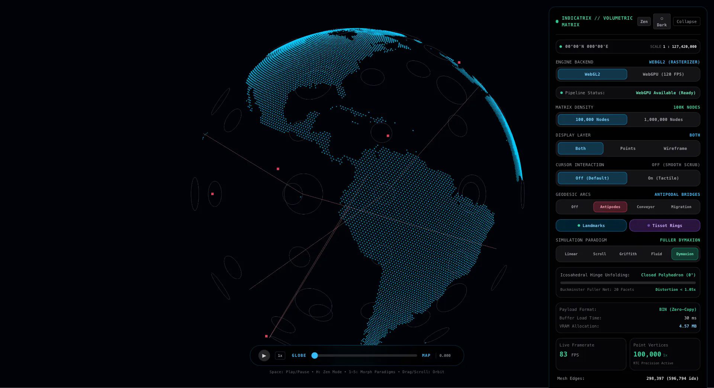

# Indicatrix


> Continuous volumetric cartographic engine morphing between spherical planetoids and planar projections across 5 scientific paradigms, geodesic networks, and real-time Tissot deformation analysis.




## Quick Start

```bash
git clone https://github.com/AndrewVoirol/interactive-globe.git
cd interactive-globe
npm install
npm run dev
```

Opens at [http://localhost:5173](http://localhost:5173). Requires Node.js 18+.

## How It Works

**Interact:** Drag the manifold to orbit in 3D. Scroll to zoom with relative-to-center (RTC) precision. Scrub the bottom dock slider or press `Space` to engage continuous auto-morph playback. Press `1`-`5` to swap simulation paradigms, `H` to enter distraction-free Zen presentation mode, and `T` to toggle Dark Cyber and Light Architectural themes.

The engine computes continuous manifold deformations across two hardware-accelerated backends:
- **WebGL2 Engine**: Custom GLSL vertex and fragment pipelines with dynamic geometry decoupling, backface culling, and 102:1 contrast point attenuation.
- **WebGPU WGSL Engine**: Zero-copy compute shader simulation running at 120 FPS, mutating particle vertex buffers directly on the GPU without CPU readbacks.

### The 5 Morphing Paradigms

1. **Linear Mix (Mode 0)**: Baseline spatial chord contraction ($p(t) = (1-t)p_0 + t p_1$).
2. **Cylindrical Scroll (Mode 1)**: Isometric cylinder unwrapping preserving equatorial arc-length and constant radius ($R \equiv 5.0$).
3. **Griffith Fracture (Mode 2)**: Linear Elastic Fracture Mechanics (LEFM) simulating tensile stress accumulation along the antimeridian seam before peeling.
4. **Fluid Flow (Mode 3)**: Incompressible 3D curl-noise Navier-Stokes advection ($\nabla \cdot \mathbf{u} = 0$) with Lamb-Oseen vortex perturbation.
5. **Buckminster Fuller Dymaxion (Mode 4)**: Mathematical icosahedral net unfolding 20 equilateral triangular facets along 19 hinges into a contiguous planar map with near-zero areal distortion ($< 1.05\times$).

### Cartographic & Scientific Overlays

- **Antipodal Bridges**: Direct great-circle chords linking diametric pairs through Earth's core (Madrid $\leftrightarrow$ Weber NZ, Honolulu $\leftrightarrow$ Okavango, Bogotá $\leftrightarrow$ Jakarta).
- **Thermohaline Ocean Conveyor**: Global deep-water thermohaline circulation loop threading the North Atlantic, Southern Ocean, and Indo-Pacific basins.
- **Pelagic Migrations**: 11,000 km non-stop trans-Pacific migration arc of the Bar-tailed Godwit and 70,000 km pole-to-pole flight of the Arctic Tern.
- **High-Precision Vector Contours**: Continuous Natural Earth 50m coastline boundaries and major global river arteries (Amazon, Nile, Yangtze, Mississippi) with antimeridian seam protection.
- **Tissot's Indicatrix Rings**: Spherical small circles transformed dynamically by the metric tensor to visualize local angular and areal deformation across projections in real time.
- **Cartographic Landmark Anchors**: High-significance reference points (Greenwich 0°, Point Nemo, Challenger Deep, Mt. Everest, Antimeridian 180°).

## Tech Stack

| Layer | Technology |
|-------|------------|
| Framework | React 19 + TypeScript |
| 3D Rendering | Three.js + React Three Fiber (`@react-three/fiber`) |
| GPU Compute | WebGPU (WGSL compute pipelines, zero-copy VRAM buffers) |
| WebGL Fallback | WebGL2 Custom GLSL Vertex & Fragment Shaders |
| Styling | Tailwind CSS 3 |
| Build Tool | Vite 6 |
| Test Suite | Vitest (44 test files, 434 test assertions) |

