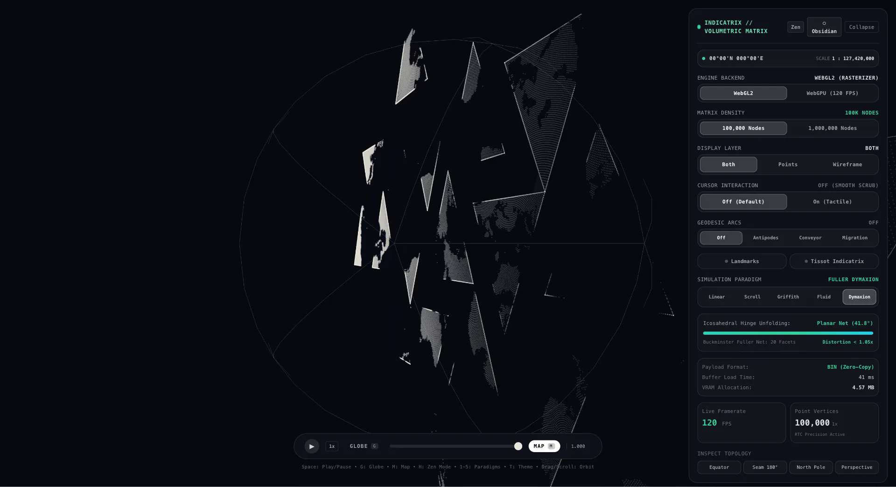
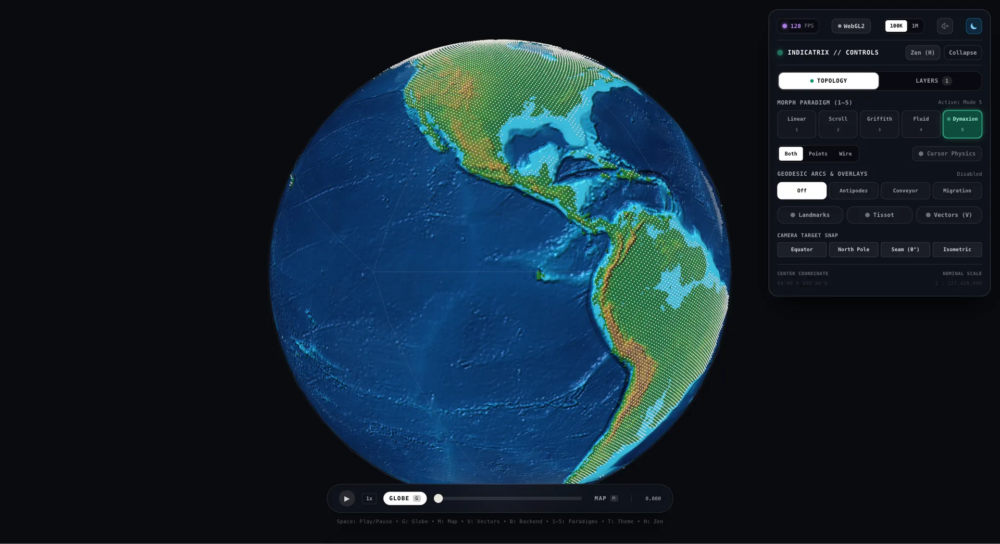

# Indicatrix


A continuous volumetric cartography engine morphing between spherical planetoids and planar projections across 5 simulation paradigms, real-time Tissot indicatrix metrics, and 16,000,000-node WebGPU compute pipelines.





## Quick Start

```bash
git clone https://github.com/AndrewVoirol/interactive-globe.git
cd interactive-globe
npm install
npm run dev
```

Opens at http://localhost:5173. Requires Node.js 18+.

## How It Works

**Take the wheel:** Click and drag the manifold to orbit in 3D. Scroll to zoom with relative-to-center precision. Scrub the bottom dock slider or tap `Space` to engage continuous auto-morph playback. Tap `1`–`5` to switch simulation paradigms on the fly, `H` to enter distraction-free Zen presentation mode, and `T` to toggle Dark Obsidian and Light Archival themes.

Under the hood, the engine governs continuous 2-manifold transformations across dual GPU backends:
- **WebGPU WGSL Engine**: Pure zero-copy compute pipeline executing at sustained 120 FPS on Apple Silicon Metal. Binds compute storage buffers directly as vertex buffers, driving particle kinematics, Jerlov oceanic radiative transfer, and Eduard Imhof Swiss relief hillshading up to 16,000,000 nodes without CPU readbacks.
- **WebGL2 Engine**: Dynamic GLSL fallback pipeline featuring backface culling, depth-balanced wireframe blending, and sub-pixel point attenuation.

### The 5 Morphing Paradigms

1. **Linear Mix (Mode 0)**: Geodesic chord contraction mitigation with continuous affine progression ($p(t) = (1-t)p_0 + t p_1$).
2. **Cylindrical Scroll (Mode 1)**: Isometric cylinder unwrapping preserving equatorial arc-length and constant radius ($R \equiv 5.0$) with singularity-free Taylor series limits.
3. **Griffith Fracture (Mode 2)**: Linear Elastic Fracture Mechanics (LEFM) simulating tensile stress accumulation along the antimeridian seam before brittle rupture.
4. **Fluid Flow (Mode 3)**: Solenoidal divergence-free 3D curl-noise Navier-Stokes advection ($\nabla \cdot \mathbf{u} = 0$) with interactive Lamb-Oseen trailing vortex wakes.
5. **Buckminster Fuller Dymaxion (Mode 4)**: 20-facet icosahedral net unfolding 20 equilateral triangular facets along 19 hinges into a contiguous planar map with near-zero areal distortion ($< 1.05\times$).

### Scientific & Cartographic Systems

- **NOAA NCEI ETOPO 2022 Global DEM**: 16-bit packed signed elevation ($-10,924\,\text{m}$ to $+8,848\,\text{m}$) streaming with sub-meter vertical precision without banding.
- **Eduard Imhof Swiss Relief Shading**: Discrete 5-tap Laplacian surface curvature, NW $315^\circ$ primary + SW $225^\circ$ fill lighting, and slope-dependent rock cliff exposure ($> 35^\circ$).
- **Jerlov Hydrosphere Optics**: Spectral downwelling attenuation $K_d(\lambda)$ across Types I–III waters, Kubelka-Munk two-flux shallow bathymetry ($0\,\text{m} - 50\,\text{m}$), and synchronous dual-surface morphing guaranteeing zero z-fighting.
- **Screen-Space Anti-Aliased Vector Ribbons**: Instanced quad extrusion with branchless 4D near-plane clipping guards ($w_c \le 0$) and Retina-invariant box-filter feathering.
- **Simon l'Huilier Contour Topology**: Spherical excess metric on $S^2$ with analytical antimeridian seam and 14 Dymaxion boundary severance.
- **Geodesic Networks & Tissot Metrics**: Real-time antipodal bridges, thermohaline ocean conveyor loops, pelagic migration arcs, and local metric tensor distortion rings.

## Tech Stack

| Layer | Technology |
|---|---|
| Framework | React 19 + TypeScript 5.8 |
| 3D & Graphics | Three.js + React Three Fiber (`@react-three/fiber`) |
| GPU Pipelines | WebGPU (WGSL compute & multi-pass render, `@webgpu/types`) |
| WebGL Fallback | WebGL2 Custom GLSL Vertex & Fragment Shaders |
| Styling | Tailwind CSS 3 |
| Build Tool | Vite 6 |
| Automated Tests | Vitest 4 (68 test files, 901 passing tests, 100% pass rate) |
