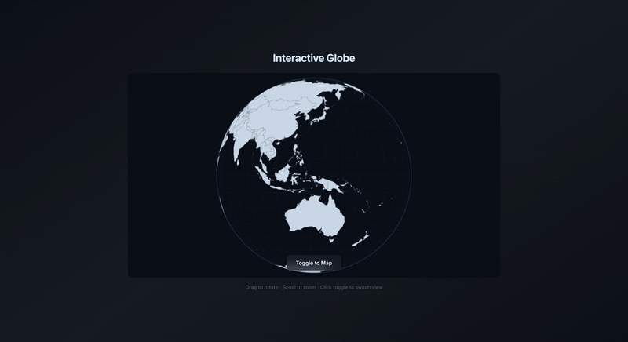
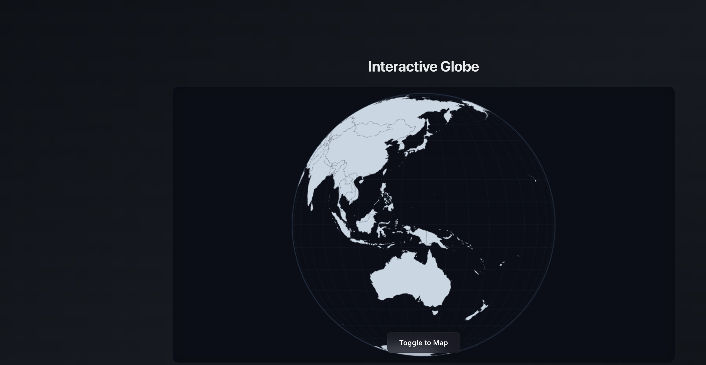
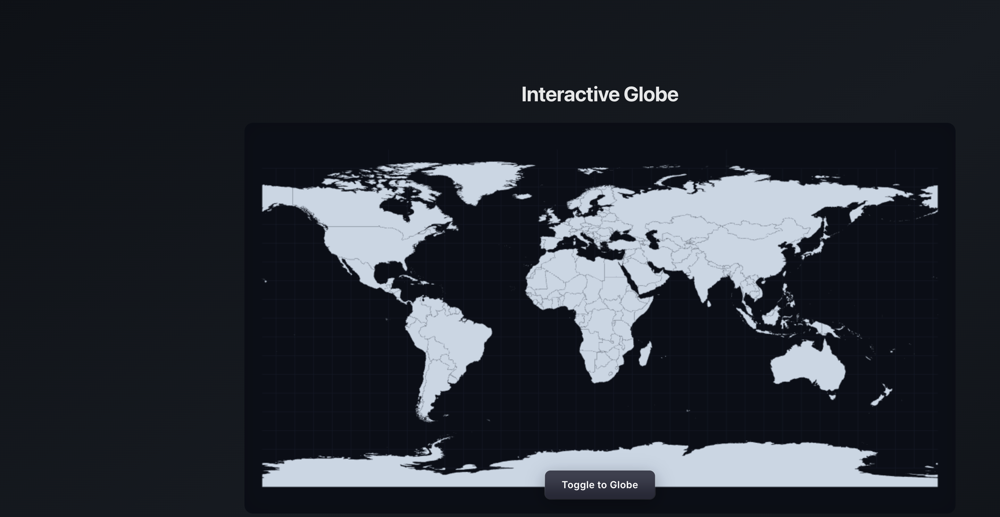

# Interactive Globe



A smooth, animated transition between a 3D rotating globe and a 2D flat map — built with React and D3.js on an HTML Canvas.

Drag to rotate, scroll to zoom, click the toggle to unfurl the globe into a flat equirectangular projection (and back again). The transition uses a custom projection interpolator that "unfurls" hidden-side countries from the globe's edge.




## Quick Start

```bash
git clone https://github.com/AndrewVoirol/interactive-globe.git
cd interactive-globe
npm install
npm run dev
```

Opens at [http://localhost:3000](http://localhost:3000). Requires Node.js 18+.

## How It Works

**Use it:** Drag the globe to spin it. Scroll to zoom. Hit the frosted-glass toggle button at the bottom to morph between globe and flat map.

The app uses two D3 projections — `geoOrthographic` (globe) and `geoEquirectangular` (flat map) — with a custom interpolator that blends between them. Points visible on the globe's front face interpolate directly; back-side points emerge from the globe's edge, creating the unfurling effect. Everything renders to a single `<canvas>` element for performance.

## Tech Stack

| Layer | Technology |
|-------|-----------|
| Framework | React 19 |
| Visualization | D3.js v7 |
| Geo Data | TopoJSON (world-atlas) |
| Rendering | HTML Canvas 2D |
| Styling | Tailwind CSS 3 |
| Build | Vite 6 |
| Language | TypeScript |
