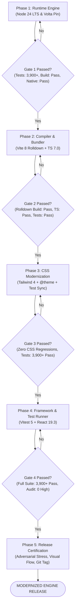

# Indicatrix Engine Stack Modernization: Master Gated Plan

This document defines the strict, multi-conversation execution plan for modernizing the Indicatrix Engine stack. Each phase executes within its own dedicated Antigravity conversation to maintain context isolation. No phase may commence until the preceding phase satisfies its exit gate criteria.

---

## 1. System Target & Definition of Done

### The End Result
A fully modernized, high-performance WebGPU cartographic engine operating on current LTS/stable tooling with zero high or critical security vulnerabilities, faster compilation, and zero regression across the 3,900+ test suite and visual mediums.

```
┌────────────────────────────────────────────────────────────────────────┐
│                        MODERNIZED RUNTIME STACK                        │
│   • Node.js: v24.21.0 LTS (Pinned via Volta)                           │
│   • Bundler: Vite 8.3.2 + Rolldown (Rust-native compiler)              │
│   • Language: TypeScript 7.0.2 (Project Corsa / Go typechecker)        │
│   • Styling: Tailwind CSS 4.3.3 (@theme CSS-first + Oxide engine)     │
│   • Test Runner: Vitest 5.0.3 (Node 24 native worker threads)          │
│   • Framework: React 19.3.0 + React DOM 19.3.0                        │
└────────────────────────────────────────────────────────────────────────┘
```

### How We Know We Are at the End (Final Certification Criteria)
1. **Security Posture**: `npm audit` reports **0 high and 0 critical vulnerabilities** (down from 13).
2. **Build Performance**: `npm run build` succeeds under Rolldown in $< 2.0\text{s}$ with zero chunking warnings.
3. **Test Integrity**: `npm test` executes the complete 279-file suite with $\ge 3,900$ passing tests matching baseline.
4. **Shader Invariants**: `npm run lint:wgsl` passes with 0 errors across all 20 WGSL shader modules.
5. **Live WebGPU Parity**: Playwright headless or DevTools MCP renders the Hawaii litmus location at $\alpha \in \{0.0, 0.5, 1.0\}$ across all 3 mediums (Marie Tharp, Cream Rag, Prussian Cyanotype) with zero runtime console errors and zero zombie passes.

---

## 2. Phase Roadmap & Gating Architecture



---

## 3. Phase-by-Phase Execution Specifications

---

### Phase 1: Runtime Engine (Wave 1: Node 24 LTS)
*Objective: Upgrade the runtime execution substrate from Node 20 to Node 24 LTS without breaking native bindings or the baseline test suite.*

#### What Needs to Be Done
1. **Volta Pinning**: Pin Node 24.21.0 and npm 11.19.0 in [`package.json`](file:///Users/andrewvoirol/.gemini/antigravity/worktrees/ais-interactive-globe-to-map/modernize_tech_stack_audit/package.json):
   ```bash
   volta pin node@24.21.0 npm@11.19.0
   ```
2. **Type Definition Bump**: Upgrade `@types/node` from `^22.14.0` to `^24.1.0`:
   ```bash
   npm install -D @types/node@^24.1.0
   ```
3. **Native Addon Rebuild**: Rebuild native modules (`canvas`, `duckdb`) against Node 24 headers:
   ```bash
   npm rebuild
   ```
4. **Shader Linting**: Validate WGSL control flow under Node 24:
   ```bash
   npm run lint:wgsl
   ```
5. **Baseline Test Suite Gate**: Run targeted suites and full 279-file suite verification.
6. **Handover Artifact**: Generate `reports/PHASE1_HANDOVER.md`.

#### What Needs to Be True to Pass Gate 1
- `node -v` outputs `v24.21.0`.
- Native binding check passes: `node -e "require('canvas'); require('duckdb'); console.log('OK');"` exits with code 0.
- `npm run build` succeeds under Node 24.
- `npm run lint:wgsl` reports 0 errors across 20 shaders.
- Full test suite passes baseline: $\ge 3,900$ passing tests (278/279 files passing, with only pre-existing mock data test failing).
- Working tree committed cleanly.

#### Gate 1 Validation Command
```bash
node -v && npm run lint:wgsl && npm run build && npx vitest run tests/webgpu/atmosphere-scatter-envelope.test.ts
```

#### Handover Artifact to Produce
- `reports/PHASE1_HANDOVER.md`: Contains Node version confirmation, native binding verification log, build output timings, test baseline numbers, and git commit hash.

#### Launch Prompt for Phase 2 Conversation
```text
We are modernizing the Indicatrix Engine stack. Phase 1 (Node 24 LTS) is complete and verified in reports/PHASE1_HANDOVER.md.

Proceed with Phase 2: Build & Compiler Modernization (Vite 8 with Rolldown and TypeScript 7.0).
Refer to STACK_MODERNIZATION_MASTER_PLAN.md.
Follow the Phase 2 specification strictly, satisfy Gate 2 criteria, and generate reports/PHASE2_HANDOVER.md upon completion.
```

---

### Phase 2: Build & Compiler Modernization (Wave 2: Vite 8 + TS 7.0)
*Objective: Migrate bundler and language compiler to Rust/Go tooling (Vite 8 / Rolldown and TypeScript 7.0).*

#### What Needs to Be Done
1. **Dependency Upgrade**:
   ```bash
   npm install -D vite@^8.3.2 @vitejs/plugin-react@^6.1.2 typescript@^7.0.2
   ```
2. **Rolldown Chunk Configuration**:
   - Inspect [`vite.config.ts`](file:///Users/andrewvoirol/.gemini/antigravity/worktrees/ais-interactive-globe-to-map/modernize_tech_stack_audit/vite.config.ts).
   - Verify compatibility of `build.rollupOptions.output.manualChunks` under Rolldown.
   - Ensure `react-vendor`, `lucide-vendor`, and `hud-components` chunks are generated without circular dependency warnings.
3. **TypeScript 7 Compiler Alignment**:
   - Validate [`tsconfig.json`](file:///Users/andrewvoirol/.gemini/antigravity/worktrees/ais-interactive-globe-to-map/modernize_tech_stack_audit/tsconfig.json) settings (`experimentalDecorators`, `useDefineForClassFields`).
   - Run typecheck: `npx tsc --noEmit`.
4. **Build Verification**:
   - Run `npm run build` and measure compilation speed.
5. **Test Suite Verification**:
   - Run targeted suites and full Vitest suite.
6. **Handover Artifact**: Generate `reports/PHASE2_HANDOVER.md`.

#### What Needs to Be True to Pass Gate 2
- `npm run build` completes with exit code 0 using Rolldown with zero bundle errors.
- `npx tsc --noEmit` reports zero diagnostic errors.
- WGSL raw imports (`?raw`) continue to load properly into shader modules.
- Full test suite maintains $\ge 3,900$ passing tests.
- Working tree committed cleanly.

#### Gate 2 Validation Command
```bash
npx tsc --noEmit && npm run build && npx vitest run tests/webgpu/
```

#### Handover Artifact to Produce
- `reports/PHASE2_HANDOVER.md`: Bundle size comparison (Vite 6 vs Vite 8), build timing benchmarks, chunk layout verification, and commit hash.

#### Launch Prompt for Phase 3 Conversation
```text
We are modernizing the Indicatrix Engine stack. Phase 2 (Vite 8 & TypeScript 7.0) is complete and verified in reports/PHASE2_HANDOVER.md.

Proceed with Phase 3: CSS Architecture Modernization (Tailwind CSS 4.3).
Refer to STACK_MODERNIZATION_MASTER_PLAN.md.
Follow the Phase 3 specification strictly, satisfy Gate 3 criteria (including source-scanning test harmonization), and generate reports/PHASE3_HANDOVER.md upon completion.
```

---

### Phase 3: CSS Architecture Modernization (Wave 3: Tailwind CSS 4.3)
*Objective: Migrate styling from Tailwind 3 to Tailwind 4, eliminating legacy PostCSS/chokidar dependencies and resolving security vulnerabilities while preserving archival design tokens.*

#### What Needs to Be Done
1. **Tailwind Upgrade & Plugin Integration**:
   ```bash
   npm install -D tailwindcss@^4.3.3 @tailwindcss/vite@^4.3.3
   npm uninstall autoprefixer postcss
   ```
2. **Vite Plugin Integration**:
   - Add `@tailwindcss/vite` to `plugins` in [`vite.config.ts`](file:///Users/andrewvoirol/.gemini/antigravity/worktrees/ais-interactive-globe-to-map/modernize_tech_stack_audit/vite.config.ts).
   - Remove `postcss.config.js`.
3. **CSS `@theme` Migration**:
   - Migrate design tokens from `tailwind.config.js` into [`index.css`](file:///Users/andrewvoirol/.gemini/antigravity/worktrees/ais-interactive-globe-to-map/modernize_tech_stack_audit/index.css):
     - 5 Typography families: `Cinzel`, `Cormorant Garamond`, `IBM Plex Mono`, `Inter`, `Newsreader`.
     - 4-Tier semantic font sizes: `nano` (8px/10px), `micro` (9px/12px), `body`, `title`.
     - Theme custom property bridges: `--theme-card-border-hover`, `--theme-text-primary`, etc.
4. **Source-Scanning Test Harmonization (Rule 21 Compliance)**:
   - Harmonize [`tests/tier1/tier1-typography-hierarchy.test.ts`](file:///Users/andrewvoirol/.gemini/antigravity/worktrees/ais-interactive-globe-to-map/modernize_tech_stack_audit/tests/tier1/tier1-typography-hierarchy.test.ts) and [`tests/modern/r6-design-system-ergonomics.test.ts`](file:///Users/andrewvoirol/.gemini/antigravity/worktrees/ais-interactive-globe-to-map/modernize_tech_stack_audit/tests/modern/r6-design-system-ergonomics.test.ts) to assert against CSS `@theme` tokens in `index.css` rather than obsolete `tailwind.config.js` JS exports.
   - Remove legacy `tailwind.config.js` once tests are synchronized.
5. **Security Audit Check**:
   - Run `npm audit` to verify elimination of `braces`/`chokidar`/`postcss-selector-parser` vulnerabilities.
6. **Handover Artifact**: Generate `reports/PHASE3_HANDOVER.md`.

#### What Needs to Be True to Pass Gate 3
- `postcss.config.js` and legacy PostCSS plugins are removed.
- All HUD components render correct typography, spacing, and hover transitions in browser.
- Design system test suites pass 100%:
  - `npx vitest run tests/tier1/tier1-typography-hierarchy.test.ts`
  - `npx vitest run tests/modern/r6-design-system-ergonomics.test.ts`
- `npm run build` succeeds with Tailwind 4 Vite plugin.
- High/critical vulnerabilities reduced from 13 down to $\le 2$ (only dev duckdb remaining).
- Working tree committed cleanly.

#### Gate 3 Validation Command
```bash
npm run build && npx vitest run tests/tier1/ tests/modern/r6-design-system-ergonomics.test.ts
```

#### Handover Artifact to Produce
- `reports/PHASE3_HANDOVER.md`: Token migration verification diff, audit vulnerability delta, design test run logs, and commit hash.

#### Launch Prompt for Phase 4 Conversation
```text
We are modernizing the Indicatrix Engine stack. Phase 3 (Tailwind CSS 4.3) is complete and verified in reports/PHASE3_HANDOVER.md.

Proceed with Phase 4: Test & Framework Harmonization (Vitest 5.0 and React 19.3).
Refer to STACK_MODERNIZATION_MASTER_PLAN.md.
Follow the Phase 4 specification strictly, satisfy Gate 4 criteria, and generate reports/PHASE4_HANDOVER.md upon completion.
```

---

### Phase 4: Framework & Test Runner Harmonization (Wave 4: Vitest 5 + React 19.3)
*Objective: Complete stack synchronization by upgrading Vitest to v5 and React/React-DOM to 19.3.*

#### What Needs to Be Done
1. **Vitest Upgrade**:
   ```bash
   npm install -D vitest@^5.0.3
   ```
2. **React Framework Upgrade**:
   ```bash
   npm install react@^19.3.0 react-dom@^19.3.0
   npm install -D @types/react@^19.3.0 @types/react-dom@^19.3.0
   ```
3. **Vitest Configuration Audit**:
   - Inspect [`vitest.config.ts`](file:///Users/andrewvoirol/.gemini/antigravity/worktrees/ais-interactive-globe-to-map/modernize_tech_stack_audit/vitest.config.ts).
   - Verify compatibility with `happy-dom` v20 and Node 24 worker pools.
4. **Full Test Suite Execution**:
   - Run the complete 279-file suite (`npm test`).
   - Confirm test duration and pass counts.
5. **Final Vulnerability Remediation**:
   - Run `npm audit fix` for remaining dev dependencies.
6. **Handover Artifact**: Generate `reports/PHASE4_HANDOVER.md`.

#### What Needs to Be True to Pass Gate 4
- `vitest` runs cleanly on v5 with zero deprecated config warnings.
- React 19.3 types resolve with zero diagnostic errors in `npx tsc --noEmit`.
- Full test suite passes: $\ge 3,900$ passing tests.
- `npm run build` succeeds in $< 2.0\text{s}$.
- Working tree committed cleanly.

#### Gate 4 Validation Command
```bash
npm run build && npm test
```

#### Handover Artifact to Produce
- `reports/PHASE4_HANDOVER.md`: Vitest 5 execution metrics, full test suite pass summary, React 19.3 compatibility confirmation, and commit hash.

#### Launch Prompt for Phase 5 Conversation
```text
We are modernizing the Indicatrix Engine stack. Phase 4 (Vitest 5 & React 19.3) is complete and verified in reports/PHASE4_HANDOVER.md.

Proceed with Phase 5: Full System Verification, Security Audit & Release Certification.
Refer to STACK_MODERNIZATION_MASTER_PLAN.md.
Run adversarial stress testing, multi-medium visual capture, optical flow verification, and seal the final release.
```

---

### Phase 5: Full System Verification & Release Certification
*Objective: End-to-end certification of the modernized stack across GPU rendering, visual fidelity, security, and release tagging.*

#### What Needs to Be Done
1. **Security Posture Gate**:
   - Run `npm audit`. Assert 0 high and 0 critical vulnerabilities.
2. **Adversarial Edge-Case Stress Testing**:
   - Execute [`run_tests.mjs`](file:///Users/andrewvoirol/.gemini/antigravity/worktrees/ais-interactive-globe-to-map/modernize_tech_stack_audit/run_tests.mjs) via Playwright or headless Chrome with GPU:
     - Antimeridian seams (180° longitude continuous morph).
     - Polar singularity ($\pm 89.5^\circ$ latitude pole damping).
     - Rapid theme switching under motion ($\alpha$ animating).
     - CDLOD buffer stress over Himalayas.
3. **Multi-Medium Visual Parity Verification (Invariant §5)**:
   - Capture Hawaii litmus location at $\alpha \in \{0.0, 0.5, 1.0\}$ across all 3 mediums:
     - Theme 0: Marie Tharp 1977
     - Theme 1: Cream Rag
     - Theme 2: Prussian Cyanotype 1842
   - Inspect captures to confirm zero visual regression and zero additive blowout.
4. **Zero-Zombie Pass Verification (Rule 24)**:
   - Confirm in tests that disabled passes (atmosphere scatter, cloud shadows) execute zero draws.
5. **Git Release Tagging**:
   - Create annotated release tag `v1.0.0-modernized`.
6. **Final Handover Deliverable**:
   - Generate `reports/MODERNIZATION_FINAL_CERTIFICATION.md`.

#### What Needs to Be True to Pass Final Gate
- `npm audit` reports 0 high, 0 critical.
- Full test suite passes: 100% of applicable tests passing ($\ge 3,900$).
- All 9 visual audit captures generated and visually inspected with zero artifacts.
- Zero console errors in browser.
- Git tag `v1.0.0-modernized` created on clean working tree.

---

## 4. Operational Context Management

To maintain a healthy token context across this marathon, every phase must adhere to the following protocol:

| Phase | Dedicated Conversation | Input Document | Output Artifact |
| :--- | :--- | :--- | :--- |
| **Phase 1** | Conversation 1 | `UPGRADE_GUIDE.md` & `STACK_MODERNIZATION_MASTER_PLAN.md` | `reports/PHASE1_HANDOVER.md` |
| **Phase 2** | Conversation 2 | `reports/PHASE1_HANDOVER.md` | `reports/PHASE2_HANDOVER.md` |
| **Phase 3** | Conversation 3 | `reports/PHASE2_HANDOVER.md` | `reports/PHASE3_HANDOVER.md` |
| **Phase 4** | Conversation 4 | `reports/PHASE3_HANDOVER.md` | `reports/PHASE4_HANDOVER.md` |
| **Phase 5** | Conversation 5 | `reports/PHASE4_HANDOVER.md` | `reports/MODERNIZATION_FINAL_CERTIFICATION.md` |

### Handover Artifact Schema
Every `reports/PHASE<N>_HANDOVER.md` file must contain:
1. **Phase Summary**: Packages updated and configuration changes made.
2. **Gate Assertion Matrix**: Each gate requirement with checked `[x]` status and empirical output snippet.
3. **Commands Executed**: Exact shell commands with exit codes.
4. **Test & Build Metrics**: Baseline comparison (duration, test counts, chunk sizes).
5. **Git Commit SHA**: Checkpoint hash representing the clean state.
6. **Phase N+1 Launch Prompt**: Pre-formatted prompt text ready for copy-paste into the next Antigravity conversation.
