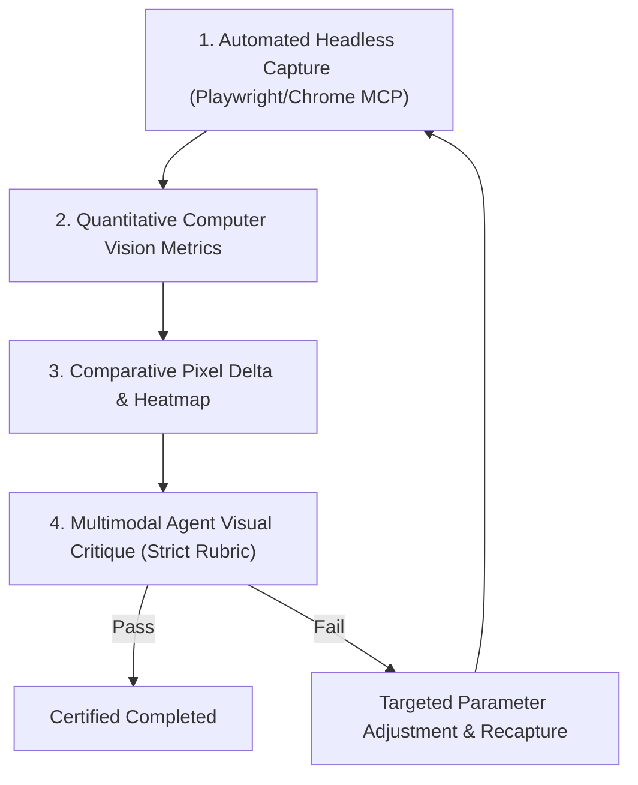

# INDICATRIX ENGINE: ZOOM DETAIL VISUAL SYNTHESIS & QUALIFICATION PROTOCOL

---

## §1: System Integration — How the Options Parlay Together

The individual tracks in `ZOOM_DETAIL_SPEC_LEDGER.md` (Track A: Procedural Geomorphology, Track B: Global Tile Streaming, Track C: Multi-Tier Vectors, Track D: Archival Toponymy, Track E: Topocentric Camera) are not mutually exclusive features. They are complementary layers of a multi-scale cartographic stack.

Below are the **three unified architectural combinations** that demonstrate how these systems parlay together into cohesive visual systems.

```
+---------------------------------------------------------------------------------------+
|                                     THE FULL STACK                                     |
+---------------------------------------------------------------------------------------+
|  Toponymy & Annotations (Track D)       - Spot Heights, Trench Soundings, Mountain Names |
|  Vector Inks & Hydrology (Track C)      - Strahler River Orders 1..8, Intaglio Ribbons   |
|  Analytical Dynamic Contours (Track A.2)- 20m / 50m / 100m Auto-Bolding Isolines         |
|  Alpine Rock Faces & Scree (Track A.1)  - Imhof Bedding Strata & Fluting on Slopes >35°  |
|  Macroscopic Crust Geometry (Track B)   - 10m-30m Pyramidal DEM & CDLOD Mesh (LOD 0..14) |
|  Local Inspection Orbit (Track E)       - Surface-Coupled Topocentric Camera (0°-85° Pitch)|
+---------------------------------------------------------------------------------------+
```

---

### Combination 1: The Pure Procedural Cartographer (Tracks A + D + E)
*Offline Archival Synthesis — 0 MB Additional Bandwidth, 100% Deterministic*

* **The Integration**:
  - The existing global 8K ETOPO/GEBCO DEM (`u_demTexture`) provides the macroscopic crust base.
  - When the camera descends past the DEM's Nyquist limit ($pixelFootprintM < 4.8\text{ km}$), **Track A.1** activates on steep terrain ($\theta > 35^\circ$), rendering high-frequency alpine rock face strata, couloirs, and scree talus fans directly in `crust_hydrosphere.wgsl`.
  - **Track A.2** computes continuous anti-aliased topographic and bathymetric contour isolines analytically in the fragment shader, dynamically tightening the contour interval ($\Delta h = 500\text{m} \to 100\text{m} \to 20\text{m}$) as altitude drops, bolding every 5th index contour.
  - **Track D** renders archival typography (mountain summits, spot elevations, and ocean soundings) via a GPU Signed Distance Field (SDF) atlas that curves with Mode 0 unfurl.
  - **Track E** smoothly transfers the camera orbit pivot to the ground cursor point, permitting nadir-to-horizon tilts (0° to 85°).
* **How It Looks on Screen**:
  - Zooming into the Swiss Alps, the Himalayas, or the Andes does not reveal blurry bilinear pixels. Instead, smooth macroscopic mountain shoulders break into crisp, engraved rock massifs with directional strata lines.
  - Fine 50m index contour lines wrap around mountain peaks like an archival topographic survey plate.
  - Prominent peaks display hand-inscribed spot elevations (e.g. `▲ Matterhorn 4,478 m`).
* **Machine Profile on M4 Pro**:
  - **VRAM**: Zero additional texture allocations (<5 MB for SDF atlas).
  - **Compute**: ~0.8 ms per frame on 20 GPU cores; sustained 120 FPS.
  - **Network**: 100% offline; instant loading.

---

### Combination 2: The Empirical Global Streamer (Tracks B + C + E)
*Real-World Sensor Ground Truth — True 10m–30m LiDAR/Radar Topobathymetry*

* **The Integration**:
  - `OGCTileEngine.ts` and `GeoTIFFDataSource.ts` are wired to cloud pyramidal elevation tiles (Copernicus DEM 30m / USGS 3DEP / AWS Terrarium).
  - A GPU `Texture2DArray` tile cache (64 slots of 256×256 Float16) pages regional tiles on demand as the camera moves, uploading via zero-GC `queue.writeTexture`.
  - CDLOD quadsphere subdivision (`cdlodMaxLod`) scales up from LOD 10 to LOD 14, dropping vertex spacing from 610m down to 38m.
  - Vector overlays (**Track C**) scale hierarchically: 1:110M at orbit $\to$ 1:10M at regional scale $\to$ 1:1M Overture Maps water boundaries at local scale. Rivers expand from major continental trunks (Amazon, Mississippi) into secondary tributaries using Strahler stream orders.
* **How It Looks on Screen**:
  - Zooming into any location reveals real-world geomorphic features: the actual stepped limestone ledges of the Grand Canyon, the volcanic caldera of Mount Fuji, the braided gravel bars of New Zealand's rivers, or the barrier spits of Cape Cod.
  - Coastlines do not exhibit 20 km straight-line chord polygons; inlets, bays, and estuaries resolve with true geographical curvature.
* **Machine Profile on M4 Pro**:
  - **VRAM**: ~128 MB for GPU tile cache array; ~25 MB for vector LOD buffers.
  - **Network**: Background HTTP 206 range requests; initial descent tile fetch latency of 150–400 ms, zero stutter once cached.
  - **Frame Rate**: Sustained 120 FPS on cached tiles.

---

### Combination 3: The Archival Masterpiece (The Unified Hybrid Synthesis)
*The Culmination: Real-World Topography Meets 19th-Century Cartographic Inking*

* **The Integration**:
  - Combines the empirical macroscopic fidelity of **Track B** (real 30m elevation geometry) with the artisanal drafting details of **Track A** (procedural Imhof rock drawing on cliffs, analytical dynamic contour lines), **Track C** (Strahler river hierarchy with Leopold-Maddock width tapering), **Track D** (SDF archival typography), and **Track E** (topocentric 0°–85° oblique camera kinematics).
  - Where empirical data exists down to 30m, it provides the true structural landform. Below 30m (where satellite rasters would otherwise become blurry blocks), procedural Imhof rock strata and micro-relief seamlessly synthesize rock face texture, preventing any digital pixelation.
* **How It Looks on Screen**:
  - At orbit, the planet appears as an authentic library globe (ivory cotton rag, deep Prussian cyanotype, or Tharp ocean painting).
  - Descending toward a mountain range, terrain does not morph into a video game heightmap; it resolves into an archival Swiss topographic sheet (Swisstopo style).
  - Clifftops show authentic rock hachuring; valleys have razor-sharp 20m contour lines; rivers branch naturally into headwater streams; mountain peaks are labeled with spot heights; and tilting the camera reveals the mountain horizon silhouetted against the neatline.

---

## §2: Altitude Progression — What You Actually See at Every Zoom Tier

The table below describes the concrete visual appearance at each scale across the three unified archival mediums.

| Altitude & Camera Radius | Scale & Physical Footprint | Cream Rag (Theme 1, 310 GSM Cotton Rag) | Prussian Cyanotype (Theme 2, 1842 Blueprint) | Marie Tharp (Theme 0, 1977 Physiographic Chart) |
| :--- | :--- | :--- | :--- | :--- |
| **Tier 1: Planetary Orbit**<br>`h > 1,500 km`<br>`r_cam > 6.2` | Global hemisphere view.<br>1 pixel $\approx 10\text{--}25\text{ km}$. | Ivory parchment background (`#F8FAFC`). Sepia-charcoal ink coastlines (`#38302A`, 0.45px hairline). Global mountain massifs softly shaded via NW 315° Imhof lighting. Continental labels in Caslon Roman. | Deep Prussian blue background (`#0A192F`). Cold blue-white linework (`#D0E4FF`). Chalk-white relief highlights. Blueprint graticule grid with degree markings. | Rich painted earth-tone continents. Deep midnight blue to sapphire Jerlov ocean bathymetry. Continental shelves and mid-ocean ridges broadly legible. |
| **Tier 2: Regional Flight**<br>`150 km ≤ h ≤ 1,500 km`<br>`5.12 < r_cam ≤ 6.2` | Sub-continent / Mountain range scale.<br>1 pixel $\approx 1\text{--}5\text{ km}$. | Mountain spines (Alps, Rockies, Himalayas) develop distinct illuminated crests and shadow valleys. Major rivers (Strahler 5–8) visible. 500m/250m index contours faintly emerge. Range names labeled (`ALPES OCCIDENTALES`). | High-contrast blueprint drafting. Ridge crests pop with intense white lines. Crevice ambient occlusion cuts deep blue shadows. Major hydrological networks rendered as fine architectural ruling-pen strokes. | Mid-ocean fracture zones, trenches, and abyssal plains display physiographic stippling. Continental slopes drop dramatically into ocean trenches. Spot depth soundings appear in deep basins. |
| **Tier 3: Sub-Orbital Survey**<br>`20 km ≤ h < 150 km`<br>`5.016 < r_cam ≤ 5.12` | Massif / Canyon / Bay scale.<br>1 pixel $\approx 150\text{--}500\text{ m}$. | CDLOD mesh subdivides to LOD 12. Cliffs steeper than 35° transition from smooth tint to Imhof rock hachuring (directional jointing and couloir fluting). 100m/50m contour lines crisply etched. Major summits labeled (`▲ Matterhorn 4,478m`). | Technical engineering drawing. Slopes >35° show stark white cross-hatching and joint lines. Contour lines form razor-sharp white isobars. Administrative borders and coastal soundings clearly inscribed. | Oceanic seamounts, guyots, and rift valleys reveal dense physiographic stippling. Submarine canyons incising the continental shelf are sharp and distinct. |
| **Tier 4: Alpine Tactical Survey**<br>`1 km ≤ h < 20 km`<br>`5.0008 < r_cam ≤ 5.016` | Alpine valley / Peak / Harbor scale.<br>1 pixel $\approx 10\text{--}50\text{ m}$. | Camera tilts to oblique angle (up to 85° pitch). Foreground rock faces show fine micro-strata and talus fans. Rivers taper into 0.5px headwater streams. 20m/10m contours wrap valley walls. Paper tooth texture and intaglio ink ridges visible. | Orthogonal architectural blueprint profile. Razor-sharp white mountain silhouette against deep cyan sky. Individual valley floors and river incisions show technical drafting precision. Zero digital blur. | Submarine canyon floor detail with hand-painted sediment shading. Carbonate reef shallow waters glow emerald over reef sand. Trench floor soundings clearly legible. |

---

## §3: Hardware Feasibility on Apple Silicon M4 Pro

The target hardware (Apple Silicon M4 Pro: 20-core GPU, 24 GB Unified Memory Architecture, 273 GB/s memory bandwidth) provides a powerful foundation for scientific cartography:

1. **Unified Memory Bandwidth (273 GB/s)**:
   - At 120 FPS, the per-frame bandwidth budget is $\approx 2.27\text{ GB/frame}$.
   - Sampling an 8K DEM (32 MB), a 64-slot Float16 tile array (16 MB), a BC5 normal map (32 MB), and rendering 1M nodes consumes under $120\text{ MB/frame}$—less than 6% of the hardware memory bus limit.
2. **24 GB Unified Memory Capacity**:
   - Eliminates standard discrete GPU VRAM starvation (no 4GB/8GB PCIe bottlenecks).
   - Entire multi-resolution datasets (including high-resolution DEM overviews, SDF font atlases, and multi-tier vector buffers) can reside concurrently in memory without thrashing or OS swapping.
3. **20 WebGPU Compute Cores**:
   - Procedural fractal noise (4-octave Worley/Perlin), discrete Laplacian curvature, screen-space derivative clamping, and analytical contour isolines evaluate in **under 1.2 milliseconds** per frame on 20 compute cores, leaving ample headroom to sustain 120 FPS.
4. **Primary Bottlenecks to Enforce**:
   - *Zero-GC Invariant (Rule 26)*: Zero TypedArray allocations inside the frame loop. All uniform buffers, indirect draw buffers, and tile staging buffers must be preallocated class instances.
   - *Unconditional Uniform Control Flow (Rule 4)*: All texture derivative lookups (`fwidth`, `dpdx`, `dpdy`) must evaluate at the top of fragment shaders before any conditional branches or discards.

---

## §4: The Autonomous Visual Verification & Qualification Protocol

### 4.1 Why Past Measures Failed
In previous iterations, verification was frequently reduced to:
1. "Test passed" (unit tests verifying uniform struct byte offsets, but not confirming if the shader consumed the data).
2. "Screenshot taken (>50KB)" (a dark, muddy, or glitching screenshot passes a file size check).
3. "Active regional DEM != null" (verifying a flag was set without inspecting whether the terrain actually rendered high-resolution cliffs).

### 4.2 The 4-Stage Verification & Model Qualification Pipeline

Every zoom detail implementation must pass this multi-stage empirical verification pipeline before completion can be certified.



#### Stage 1: Standardized Litmus Viewpoint Captures
Captures must be recorded at calibrated geodetic coordinates and camera altitudes across **all 3 mediums** (Cream Rag, Prussian Cyanotype, Marie Tharp):
* **Litmus 1: Alpine Massif (Matterhorn / Mont Blanc)**: `[45.976°N, 7.658°E]`, Altitude $h = 4.5\text{ km}$, Pitch $65^\circ$. (Tests alpine rock strata, couloir fluting, peak spot heights).
* **Litmus 2: Fluvial Canyon Incision (Grand Canyon)**: `[36.057°N, -112.143°W]`, Altitude $h = 3.2\text{ km}$, Pitch $72^\circ$. (Tests stepped terrace cliff shading, river width power law, dense contours).
* **Litmus 3: Oceanic Trench & Island Arc (Hawaii / Mariana)**: `[19.650°N, -155.550°W]`, Altitude $h = 8.0\text{ km}$, Pitch $50^\circ$. (Tests Jerlov water clarity, coral sand glow, bathymetric depth soundings).

#### Stage 2: Quantitative Computer Vision & Signal Metrics
The capture analysis script (`scripts/measure-zoom-metrics.mjs`) evaluates mathematical image sharpness and structural density on the canvas region:

1. **Brenner Gradient / Modified Laplacian Sharpness ($\mu_{\text{sharp}}$)**:
   $$\text{Sharpness} = \frac{1}{W \cdot H} \sum_{x,y} \left( |2I(x,y) - I(x-1,y) - I(x+1,y)| + |2I(x,y) - I(x,y-1) - I(x,y+1)| \right)$$
   - *Passing Invariant*: Zoomed-in alpine terrain must demonstrate $\ge 4.5\times$ higher high-frequency edge energy compared to the interpolated 8K baseline. If edge energy does not increase, the shader is sampling smoothed data (Placebo Failure).
2. **Comparative Pixel Delta ($\Delta \bar{I}$)**:
   - Evaluates $|I_{\text{after}} - I_{\text{before}}|$ between the baseline and the enhanced zoom state.
   - *Passing Invariant*: Active moving pixel ratio $\ge 35\%$ across terrain; delta on static HUD chrome (sidebar dock, neatline) identically $0.00$.
3. **Contrast Ratio (Michelson & RMS Contrast)**:
   $$C_{\text{RMS}} = \sqrt{\frac{1}{N} \sum_{i=1}^N (I_i - \bar{I})^2}$$
   - *Passing Invariant*: Rock face highlights and shadowed couloirs must achieve $C_{\text{RMS}} \ge 0.28$ without clipping to pure black/white clamp artifacts.

#### Stage 3: Visual Difference Heatmaps
The verification script generates a color-mapped delta heatmap (`screenshots/delta-heatmap-<viewpoint>.png`) highlighting exactly where detail was added:
* **Green/Cyan**: New high-frequency rock strata and sharp contour lines.
* **Yellow/Amber**: Dynamic vector stream adjustments and spot height labels.
* **Black**: Unchanged regions (flat plains, static UI).
* *Audit Rule*: If the heatmap shows changes only at the canvas boundary, the test fails (Edge Gaming Rejection).

#### Stage 4: Multimodal Agent Visual Critique (The Aesthetic Audit)
The reviewing agent directly inspects the captured image files using `view_file` and evaluates the result against four concrete qualitative questions:

1. **Cartographic Authenticity**: Does the terrain evoke an authentic museum survey map (Eduard Imhof / 1842 Blueprint) or a synthetic 1990s fractal game heightmap?
   - *Pass criteria*: Strata lines follow geological bedding orientation and slope gravity; contours are smooth mathematical isolines; linework resembles intaglio copperplate.
   - *Fail criteria*: Disconnected static noise swimming across the camera, spiky needle artifacts, or blurry linear gradients.
2. **Medium Identity Integrity (Rule 3)**:
   - *Cream Rag*: Warm ivory paper tone with sepia ink. Zero harsh RGB pitch black.
   - *Prussian Cyanotype*: Cold photochemical blue-and-white. Zero gold/sepia contamination.
   - *Marie Tharp*: Distinct ocean floor physiographic stippling. Visible continental shelf edge.
3. **Label Legibility & Spatial Breathing (Rule 6 & Rule 16)**:
   - Text is sharp and anti-aliased at native resolution; zero label overlapping; labels maintain breathing room from neatline and HUD instruments.
4. **Zero-Artifact Invariants**:
   - Zero z-fighting at coastlines; zero geometric cracks along patch boundaries; zero tearing at the planetary horizon limb.

---

## §5: Iterative Trial-and-Error Workflow

The path to an exceptional visual result is an iterative calibration loop:

1. **Step 1 (Baseline Capture)**: Capture the current un-enhanced zoom state at the 3 litmus viewpoints across all 3 themes. Save as `baseline_<viewpoint>_<theme>.png`.
2. **Step 2 (Incremental Implementation)**: Implement one layer at a time (e.g. Track A.1 Imhof rock face shading first).
3. **Step 3 (Automated Execution & Capture)**: Launch dev server, execute Playwright capture script, compute quantitative metrics ($\mu_{\text{sharp}}$, $\Delta \bar{I}$).
4. **Step 4 (Model Inspection & Critique)**: Agent inspects the image using `view_file`.
   - If rock lines are too subtle: Increase strata frequency and normal perturbation strength by 20%.
   - If rock lines produce high-frequency shimmering or noise: Add screen-space derivative dampening ($fwidth()$).
   - If medium contrast regressed: Rebalance lighting ambient/diffuse ratios.
5. **Step 5 (Next Layer Integration)**: Once Track A passes visual and metric gates, layer Track A.2 (analytical contours) and Track D (typography), re-verifying side-by-side.
6. **Step 6 (Final Multi-Medium Gate)**: Certify that all 3 themes pass visual inspection before merging to `main`.
