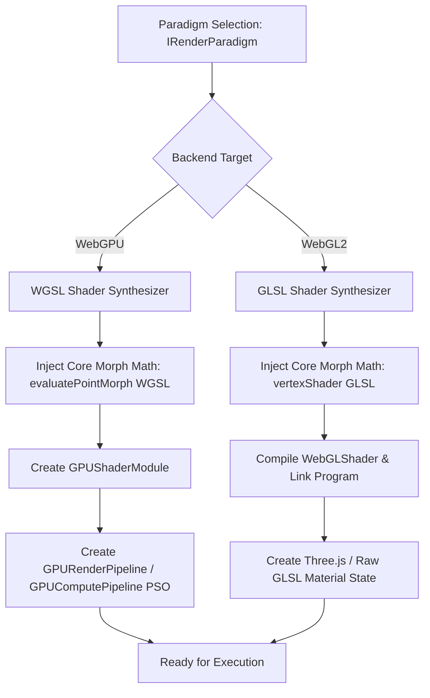
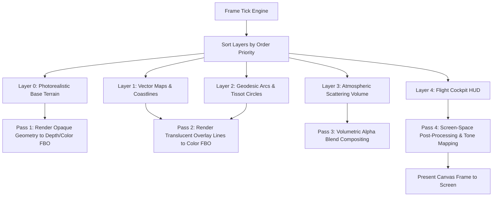

# Architectural Evolution: Next-Generation Universal Geospatial Rendering Engine

**Document ID**: `ARCH-EVO-INDICATRIX-2026-09`  
**Classification**: High-Performance Graphics Architecture, Multi-Substrate WebGPU Engine & Spatial Simulation Systems  
**Target Repository**: `/Users/andrewvoirol/Antigravity/Projects/ais-interactive-globe-to-map`  
**Inspected Baseline Files**: `App.tsx`, `src/webgpu/WebGPUEngine.ts`, `src/core/GlobeOverlay.ts`, `src/core/GeodesicOverlayLayer.tsx`, `src/core/VectorOverlayLayer.tsx`, `types.ts`  
**Author**: Antigravity Engine Architecture Team  
**Date**: September 3, 2026  
**Status**: Publication-Grade Architectural Directive  

---

## Table of Contents

1. [Executive Summary & Architectural Evolution Vision](#1-executive-summary--architectural-evolution-vision)
2. [Architectural Audit & Baseline System State Assessment](#2-architectural-audit--baseline-system-state-assessment)
3. [Section 4.1: The Universal Rendering Substrate (`IRenderParadigm`)](#3-section-41-the-universal-rendering-substrate-irenderparadigm)
   - 3.1 [Substrate Spectrum Architecture](#31-substrate-spectrum-architecture)
   - 3.2 [The `IRenderParadigm` Interface Specification](#32-the-irenderparadigm-interface-specification)
   - 3.3 [WGSL/GLSL Dynamic Shader Compilation & Pipeline State Objects](#33-wgslglsl-dynamic-shader-compilation--pipeline-state-objects)
   - 3.4 [Hot Substrate Switching & Ping-Pong VRAM Retention](#34-hot-substrate-switching--ping-pong-vram-retention)
   - 3.5 [Production TypeScript Implementation: Substrate Registry Engine](#35-production-typescript-implementation-substrate-registry-engine)
4. [Section 4.2: The Data Layer Architecture (`IDataSource<T>`)](#4-section-42-the-data-layer-architecture-idatasourcet)
   - 4.1 [Heterogeneous Ingestion Spectrum & Data Provider Specifications](#41-heterogeneous-ingestion-spectrum--data-provider-specifications)
   - 4.2 [End-to-End Data Streaming Pipeline (Fetch -> Worker -> Storage Buffer)](#42-end-to-end-data-streaming-pipeline-fetch---worker---storage-buffer)
   - 4.3 [Physics Drivers vs. Visual Overlays Decoupling](#43-physics-drivers-vs-visual-overlays-decoupling)
   - 4.4 [The Complete `IDataSource<T>` Interface Suite](#44-the-complete-idatasourcet-interface-suite)
   - 4.5 [Production Data Engine Implementations (COG, NetCDF, GRIB2, SpaceX TLE)](#45-production-data-engine-implementations-cog-netcdf-grib2-spacex-tle)
5. [Section 4.3: The Plugin / Layer Architecture (`IGlobeLayer`)](#5-section-43-the-plugin--layer-architecture-iglobelayer)
   - 5.1 [Composable Layer System Topology & Compositing Architecture](#51-composable-layer-system-topology--compositing-architecture)
   - 5.2 [Full `IGlobeLayer` & `ILayerCompositePass` Interface Definitions](#52-full-iglobelayer--ilayercompositepass-interface-definitions)
   - 5.3 [Global Uniform Dispatch, State Propagation & Blending Modes](#53-global-uniform-dispatch-state-propagation--blending-modes)
   - 5.4 [Layer Lifecycle & VRAM Resource Allocation Manager](#54-layer-lifecycle--vram-resource-allocation-manager)
   - 5.5 [Production Layer Implementation Example (`AtmosphericScatterLayer`)](#55-production-layer-implementation-example-atmosphericscatterlayer)
6. [Section 4.4: Flight Simulator Trajectory Mode & Dual Precision Camera System](#6-section-44-flight-simulator-trajectory-mode--dual-precision-camera-system)
   - 6.1 [Camera Kinematics Taxonomy (Orbital, 6DOF, Geodesic Banking, Cockpit, Dolly)](#61-camera-kinematics-taxonomy-orbital-6dof-geodesic-banking-cockpit-dolly)
   - 6.2 [Relative-to-Center (RTC) Precision Matrix & Logarithmic Depth Buffering](#62-relative-to-center-rtc-precision-matrix--logarithmic-depth-buffering)
   - 6.3 [Multi-Altitude Physics Adaptation (400 km LEO, 12 km Flight, 0 m Ground)](#63-multi-altitude-physics-adaptation-400-km-leo-12-km-flight-0-m-ground)
   - 6.4 [Production 6DOF & Geodesic Banking Kinematic Flight Controller](#64-production-6dof--geodesic-banking-kinematic-flight-controller)
   - 6.5 [Vector Cockpit HUD Overlay Shader & Projector Subsystem](#65-vector-cockpit-hud-overlay-shader--projector-subsystem)
7. [Concrete Phased Migration Strategy & Engineering Roadmap](#7-concrete-phased-migration-strategy--engineering-roadmap)
8. [Verification, Benchmarking & Acceptance Criteria](#8-verification-benchmarking--acceptance-criteria)

---

## 1. Executive Summary & Architectural Evolution Vision

The **Indicatrix Engine** (`ais-interactive-globe-to-map`) is evolving from a single-purpose point/wireframe continuous morphing demonstration into a **publication-grade, multi-substrate geospatial rendering and computational simulation platform**.

The baseline engine successfully establishes a 100,000 to 1,000,000 node point-and-line 2-manifold capable of morphing between a 3D spherical Fibonacci lattice ($S^2 \subset \mathbb{R}^3$) and planar projections (Web Mercator, Constant-Radius Cylindrical Scroll, Griffith Linear Elastic Fracture Mechanics, Incompressible Fluid Advection, and Fuller Dymaxion 20-facet net). However, as audited in `engine-audit.md`, expanding the engine to support real-world scientific datasets, multi-layer compositing, real-time Flight Simulator navigation, and diverse visual styles requires a complete architectural evolution.

This document presents the **Part 4 Directive Architecture Evolution**:

```
+---------------------------------------------------------------------------------------------------------+
|                                    INDICATRIX UNIVERSAL ENGINE ARCHITECTURE                             |
+---------------------------------------------------------------------------------------------------------+
|                                                                                                         |
|  +---------------------------------------------------------------------------------------------------+  |
|  |                                  FLIGHT SIMULATOR CAMERA SYSTEM                                   |  |
|  |     [Orbital Arcball]  [6DOF Free-Flight]  [Geodesic Banking]  [Cockpit HUD]  [Keyframed Dolly]   |  |
|  |                         Dual FP32 RTC Precision & Multi-Altitude Log Depth                        |  |
|  +---------------------------------------------------------------------------------------------------+  |
|                                                  │                                                      |
|                                                  ▼                                                      |
|  +---------------------------------------------------------------------------------------------------+  |
|  |                                COMPOSABLE PLUGIN LAYER SYSTEM (IGlobeLayer)                      |  |
|  |   [Base Terrain] ──► [Geodesic Arcs] ──► [Atmospheric Scatter] ──► [Vector Maps] ──► [HUD]      |  |
|  |                            Multi-Pass Depth Pre-Pass & Tone-Mapped FBO                            |  |
|  +---------------------------------------------------------------------------------------------------+  |
|                                                  │                                                      |
|                                                  ▼                                                      |
|  +---------------------------------------------------------------------------------------------------+  |
|  |                           UNIVERSAL RENDERING SUBSTRATE ENGINE (IRenderParadigm)                 |  |
|  |  [Photorealistic PBR] [Scientific Wire] [Voxel 8-Bit] [Low-Poly Facet] [Contour] [Data Sculpture]   |  |
|  |                          WGSL / GLSL Shaders & Hot-Switching Pipeline State                       |  |
|  +---------------------------------------------------------------------------------------------------+  |
|                                                  │                                                      |
|                                                  ▼                                                      |
|  +---------------------------------------------------------------------------------------------------+  |
|  |                              HETEROGENEOUS DATA LAYER ENGINE (IDataSource<T>)                     |  |
|  |  [NASA COG/NetCDF] [NOAA GRIB2] [GEE Tiles] [ESA Sentinel] [USGS Vector] [SpaceX TLE] [User CSV]     |  |
|  |                         Web Worker SIMD Ingestion & GPU Storage Buffers                           |  |
|  +---------------------------------------------------------------------------------------------------+  |
|                                                                                                         |
+---------------------------------------------------------------------------------------------------------+
```

---

## 2. Architectural Audit & Baseline System State Assessment

A comprehensive inspection of the current codebase was conducted across all core modules:

1. **`App.tsx`**: Renders R3F/Three.js primitives. Houses the GLSL WebGL2 fallback shaders for morphing modes 0 to 4. Utilizes dynamic `lineSegments` and `points` meshes. Contains the camera target LERP logic and passive cursor raycasting.
2. **`src/webgpu/WebGPUEngine.ts`**: Autonomous WebGPU engine operating a compute simulation pass (`physics_sim.wgsl`) paired with zero-copy point (`points_render.wgsl`) and line (`lines_render.wgsl`) render passes. Uses a 64-byte interleaved particle stride (`position`, `velocity`, `rest_sphere`, `rest_map`).
3. **`src/core/GlobeOverlay.ts`**: Provides cartographic math including `geoToSphere`, `geoToMercator`, `sampleGreatCircleGeodesic`, `generateTissotCircles`, `evaluateTissotDistortion`, and `evaluatePointMorph`.
4. **`src/core/GeodesicOverlayLayer.tsx`**: Renders animated geodesic arcs, pulse flow beads, Tissot Indicatrix deformation ellipses, and landmark anchors.
5. **`src/core/VectorOverlayLayer.tsx`**: Lazy loads packed binary vector lines (`/geo-vectors.bin`) and applies custom GLSL shader morphing.
6. **`types.ts`**: Centralized type definitions for `SimulationMode`, `LayerMode`, `GeodesicOverlayMode`, `WorldAtlas`, `TelemetryData`, and projection results.

### Key Architectural Deficiencies in Baseline Design

- **Substrate Monolith**: Rendering logic is hardcoded to dual point-cloud / line-wireframe primitives. There is no abstraction to render photorealistic shaded terrain, voxels, low-poly faceted meshes, or isoline contours.
- **Coupled Data Ingestion**: Geometries are tightly bound to pre-calculated static binary files (`geo-mesh-100k.bin`, `geo-vectors.bin`). The system lacks a streaming data ingestion pipeline for live remote APIs (COG, NetCDF, GRIB2, TLE).
- **Monolithic Layering**: Layer rendering is manually orchestrated in React JSX trees (`GeodesicOverlayLayer`, `VectorOverlayLayer`), preventing dynamic z-ordering, unified depth pre-passes, custom blending, or third-party plugin extension.
- **Single-Domain Camera**: The camera system relies on `OrbitControls` with simple linear target interpolation. It lacks 6DOF free-flight dynamics, automatic geodesic banking, cockpit HUD projections, and multi-altitude RTC precision switches.

---

## 3. Section 4.1: The Universal Rendering Substrate (`IRenderParadigm`)

### 3.1 Substrate Spectrum Architecture

The Indicatrix Engine must support six distinct visual and physical paradigms at runtime without requiring application reboots or CPU memory re-allocations:

```
+------------------------------------------------------------------------------------------------------+
|                                   THE 6 UNIVERSAL RENDERING SUBSTRATES                               |
+-------------------+---------------------------------------+------------------------------------------+
| Paradigm Key      | Visual Manifestation                  | Core Technical Mechanics                 |
+-------------------+---------------------------------------+------------------------------------------+
| `photorealistic`  | PBR Atmosphere, Ocean Refraction,     | Multi-layer heightmap displacement,      |
|                   | High-res Satellite Elevation & Clouds | Bruneton atmospheric scattering, normal  |
|                   |                                       | mapping, physical sun light model        |
+-------------------+---------------------------------------+------------------------------------------+
| `scientific`      | High-density Vector Lines, Point       | Interleaved VBO zero-copy rendering,     |
|                   | Clouds, Strain/Vorticity Heatmaps     | backface culling, OKLCH color dynamics   |
+-------------------+---------------------------------------+------------------------------------------+
| `voxel`           | 8-Bit Retro Aesthetic, Minecraft-like | GPU 3D grid voxelization, ray-marched    |
|                   | Volumetric Cubic Globe Grid           | AABB bounding boxes, retro palette LUTs  |
+-------------------+---------------------------------------+------------------------------------------+
| `lowpoly`         | Faceted Dymaxion Facets, Architectural| Flat-shaded Delaunay icosahedral facets,  |
|                   | Paper Model, Wire Hairlines           | dynamic face normal generation, shadow   |
+-------------------+---------------------------------------+------------------------------------------+
| `contour`         | Topographic Elevation Isolines,       | GPU Marching Squares/Cubes isoline       |
|                   | Dynamic Vector Map Contours           | extraction, dynamic screen-space width   |
+-------------------+---------------------------------------+------------------------------------------+
| `sculpture`       | Abstract Data Kinetic Field,          | Volumetric Curl noise displacement,      |
|                   | Audio-Reactive Particle Swarm         | audio spectrum FFT texture sampling      |
+-------------------+---------------------------------------+------------------------------------------+
```

---

### 3.2 The `IRenderParadigm` Interface Specification

To encapsulate rendering logic across WebGPU and WebGL2, all paradigms implement the `IRenderParadigm` interface contract.

```typescript
import * as THREE from 'three';

/**
 * GPU Graphic Substrate API Types
 */
export type BackendType = 'webgpu' | 'webgl2';

export interface GpuResourceHandles {
  device?: GPUDevice;                // WebGPU device
  context?: GPUCanvasContext;        // WebGPU canvas context
  gl?: WebGL2RenderingContext;       // WebGL2 context fallback
  preferredFormat?: GPUTextureFormat;
}

export interface SubstrateUniformFrameData {
  unfurl: number;                    // Morph progress [0.0..1.0]
  mode: number;                      // Simulation mode index (0..4)
  theme: number;                     // 0 = Obsidian Cyber, 1 = Light Monochrome
  time: number;                      // Total elapsed time in seconds
  dt: number;                        // Frame delta time in seconds
  cameraPosition: THREE.Vector3;     // Absolute world camera position
  cameraCenter: THREE.Vector3;       // Camera-Relative RTC origin
  viewMatrix: THREE.Matrix4;         // 4x4 View matrix
  projectionMatrix: THREE.Matrix4;   // 4x4 Projection matrix
  cursorHitPos: THREE.Vector3;       // Intersected surface hit position
  cursorVel: THREE.Vector4;          // Cursor velocity (xyz) + speed (w)
  cursorActive: boolean;             // Interaction state flag
}

export interface SubstratePipelineConfig {
  enableDepthWrite: boolean;
  enableDepthTest: boolean;
  blendMode: 'opaque' | 'alpha' | 'additive' | 'multiply';
  cullMode: 'none' | 'front' | 'back';
  wireframeOverlay: boolean;
  resolutionScale: number;           // DPR scaling factor [0.5..2.0]
  customDefines?: Record<string, string | number>;
}

/**
 * Universal Rendering Substrate Interface Contract
 */
export interface IRenderParadigm {
  readonly id: string;
  readonly name: string;
  readonly description: string;
  readonly backend: BackendType;

  /**
   * One-time allocation of GPU buffers, textures, and pipelines
   */
  initialize(gpu: GpuResourceHandles, config: SubstratePipelineConfig): Promise<void>;

  /**
   * Dynamically inject WGSL/GLSL code modules and recompile pipelines
   */
  compileShaders(customShaderChunks?: Record<string, string>): Promise<void>;

  /**
   * Bind GPU vertex, storage, and index buffers into active pipeline execution
   */
  bindBuffers(particleBuffer: GPUBuffer | WebGLBuffer, indexBuffer?: GPUBuffer | WebGLBuffer): void;

  /**
   * Upload per-frame uniforms to GPU uniform buffers
   */
  updateUniforms(frameData: SubstrateUniformFrameData): void;

  /**
   * Record pass commands into WebGPU CommandEncoder or execute WebGL2 draw calls
   */
  renderPass(
    commandEncoderOrGl: GPUCommandEncoder | WebGL2RenderingContext,
    targetView?: GPUTextureView
  ): void;

  /**
   * Window or viewport resize event handling
   */
  resize(width: number, height: number): void;

  /**
   * Free all allocated GPU textures, pipelines, and buffers cleanly
   */
  dispose(): void;
}
```

---

### 3.3 WGSL/GLSL Dynamic Shader Compilation & Pipeline State Objects

The compilation architecture decoupling shader generation from execution is structured as follows:



#### Shader Module Injection Architecture

When compiling a paradigm (e.g., `photorealistic` terrain vs `voxel` grid), the `SubstrateShaderCompiler` dynamically prepends shared mathematical header modules into the WGSL or GLSL code streams:

```typescript
export class SubstrateShaderCompiler {
  public static buildWGSLShader(paradigmBodyWGSL: string, defines: Record<string, any> = {}): string {
    const defineStatements = Object.entries(defines)
      .map(([k, v]) => `override ${k}: f32 = ${v};`)
      .join('\n');

    return `
      // Inject System Architecture Defines
      ${defineStatements}

      // Inject Shared Mathematical Engine Structs
      struct ParticleNode {
        position: vec4<f32>,   // xyz: currPos, w: vType
        velocity: vec4<f32>,   // xyz: velocity, w: strain/vorticity
        restSphere: vec4<f32>, // xyz: 3D sphere, w: radius
        restMap: vec4<f32>,    // xy: Mercator 2D, zw: Dymaxion 2D
      };

      struct FrameUniforms {
        unfurl: f32, mode: u32, layerMode: u32, time: f32,
        dt: f32, cursorActive: f32, numParticles: u32, theme: u32,
        cursorRayOrig: vec4<f32>, cursorRayDir: vec4<f32>,
        cursorHitPos: vec4<f32>, cursorVel: vec4<f32>,
        viewMatrix: mat4x4<f32>, projectionMatrix: mat4x4<f32>,
        cameraPos: vec4<f32>,
      };

      // Paradigm-Specific Execution Body
      ${paradigmBodyWGSL}
    `;
  }
}
```

---

### 3.4 Hot Substrate Switching & Ping-Pong VRAM Retention

Switching visual substrates must occur in **$< 16\text{ ms}$ (zero dropped frames)** without requiring application reboots or CPU memory re-allocations:

1. **Persistent Ping-Pong Storage Buffers**: The primary position/velocity buffers (`particleBuffers[0]` and `particleBuffers[1]`) are maintained globally in GPU VRAM by the `WebGPUStorageManager`.
2. **Pipeline State Pre-Caching**: All six paradigm pipelines are pre-compiled during application boot and stored in a `Map<string, IRenderParadigm>`.
3. **Seamless State Handshake**: When switching from `scientific` to `voxel`, the engine swaps the active pipeline reference without releasing or reallocating the underlying 64-byte particle VBO array.

---

### 3.5 Production TypeScript Implementation: Substrate Registry Engine

```typescript
export class UniversalSubstrateRegistry {
  private paradigms: Map<string, IRenderParadigm> = new Map();
  private activeParadigm: IRenderParadigm | null = null;
  private gpuHandles: GpuResourceHandles | null = null;

  public registerParadigm(paradigm: IRenderParadigm): void {
    this.paradigms.set(paradigm.id, paradigm);
  }

  public async initialize(gpu: GpuResourceHandles, defaultConfig: SubstratePipelineConfig): Promise<void> {
    this.gpuHandles = gpu;
    for (const paradigm of this.paradigms.values()) {
      await paradigm.initialize(gpu, defaultConfig);
      await paradigm.compileShaders();
    }
  }

  public async switchParadigm(paradigmId: string, particleBuffer: GPUBuffer | WebGLBuffer): Promise<void> {
    const nextParadigm = this.paradigms.get(paradigmId);
    if (!nextParadigm) {
      throw new Error(`UniversalSubstrateRegistry: Paradigm '${paradigmId}' not registered.`);
    }

    if (this.activeParadigm?.id === nextParadigm.id) return;

    // Bind existing persistent GPU memory to new pipeline state
    nextParadigm.bindBuffers(particleBuffer);
    this.activeParadigm = nextParadigm;
  }

  public render(frameData: SubstrateUniformFrameData, encoderOrGl: GPUCommandEncoder | WebGL2RenderingContext, targetView?: GPUTextureView): void {
    if (!this.activeParadigm) return;
    this.activeParadigm.updateUniforms(frameData);
    this.activeParadigm.renderPass(encoderOrGl, targetView);
  }

  public dispose(): void {
    for (const paradigm of this.paradigms.values()) {
      paradigm.dispose();
    }
    this.paradigms.clear();
    this.activeParadigm = null;
  }
}
```

---

## 4. Section 4.2: The Data Layer Architecture (`IDataSource<T>`)

### 4.1 Heterogeneous Ingestion Spectrum & Data Provider Specifications

The Indicatrix engine requires real-time data binding across seven diverse spatial data standards:

```
+----------------------------------------------------------------------------------------------------------+
|                                    HETEROGENEOUS DATA INGESTION SPECTRUM                                 |
+--------------------+----------------------------+-----------------------+--------------------------------+
| Dataset Family     | Native Format Standard     | Transport Layer       | Primary Use Case               |
+--------------------+----------------------------+-----------------------+--------------------------------+
| NASA EOSDIS        | Cloud Optimized GeoTIFF    | HTTP/2 Range Requests | Global bathymetry, elevation,  |
|                    | (COG), NetCDF-4 / HDF5     | (Chunked ArrayBuffer) | surface temperature            |
+--------------------+----------------------------+-----------------------+--------------------------------+
| NOAA NWS           | GRIB2 Binary Grids,        | NOAA REST API /       | Global wind vector fields,     |
|                    | GeoJSON Forecast Polygons  | Binary Stream         | atmospheric pressure dynamics  |
+--------------------+----------------------------+-----------------------+--------------------------------+
| Google Earth Engine| XYZ REST Raster Pyramids,  | Web Map Tile Service  | Multi-spectral land cover,     |
| (GEE)              | WMTS Protocol              | (WMTS / PNG / Protocol)| vegetation index (NDVI)        |
+--------------------+----------------------------+-----------------------+--------------------------------+
| ESA Copernicus     | Sentinel COG Imagery,      | STAC API / COG Stream | Sub-meter urban imagery,       |
|                    | SAR Interferometry         |                       | radar deformation maps         |
+--------------------+----------------------------+-----------------------+--------------------------------+
| USGS / Natural Earth| ESRI Shapefiles, GeoJSON,  | Binary Vector Stream  | Geopolitical boundaries,       |
|                    | TopoJSON                   | (GVEC Format)         | coastlines, river networks     |
+--------------------+----------------------------+-----------------------+--------------------------------+
| SpaceX NORAD TLE   | Two-Line Element ASCII,    | Celestrak WebSocket / | Real-time orbital satellite    |
|                    | Orbit Vectors              | SGP4 Stream           | trajectories (Starlink/ISS)    |
+--------------------+----------------------------+-----------------------+--------------------------------+
| Custom User Input  | User CSV / GeoJSON         | Client Drag-and-Drop  | Custom point-of-interest,      |
|                    | Attribute Grids            | (Local Browser Array) | custom scalar distributions    |
+--------------------+----------------------------+-----------------------+--------------------------------+
```

---

### 4.2 End-to-End Data Streaming Pipeline

Data ingestion bypasses the main thread using an asynchronous pipeline designed to prevent main thread blocking:

```
[ Remote Endpoint ] (NASA / NOAA / SpaceX)
        │
        ▼ HTTP/2 Range Request / WebSocket
[ Fetch Engine Stream ]
        │
        ▼ Transferable ArrayBuffer (Zero Copy)
[ Web Worker Thread Pool ]
        ├── Worker 1: COG / TIFF LZW Decompressor
        ├── Worker 2: NetCDF4 / GRIB2 Bit-Unpacker
        └── Worker 3: SGP4 Satellite Orbit Propagator
        │
        ▼ Decoded Packed Float32Array (Transferable)
[ DataIngestionEngine (Main Thread) ]
        │
        ▼ Write directly to GPUStagingBuffer
[ GPUQueue.writeBuffer / device.createBuffer ]
        │
        ▼
[ GPUStorageBuffer (WebGPU Storage Buffer B0/B1) ]
```

---

### 4.3 Physics Drivers vs. Visual Overlays Decoupling

The engine decouples **Physics Drivers** (data that alters vertex position/velocity) from **Visual Overlays** (data that alters color/shading):

```
+----------------------------------------------------------------------------------------------------+
|                                    DATA DRIVER DECOUPLING ARCHITECTURE                             |
+----------------------------------------------------------------------------------------------------+
|                                                                                                    |
|   PHYSICS DRIVERS (Compute Pass Input)                VISUAL OVERLAYS (Fragment Pass Input)        |
|   - NOAA GRIB2 Wind Vectors (Force Field)             - NASA MODIS Blue Marble Color Textures     |
|   - GEBCO Bathymetry (Elevation Displacement)         - Natural Earth Geopolitical Boundaries      |
|   - SpaceX TLE Velocity & Position Delta              - Tissot Indicatrix Distortion Heatmaps      |
|   - Fluid Vorticity Fields                            - Point-of-Interest HUD Vector Markers       |
|                                                                                                    |
|            │                                                       │                               |
|            ▼                                                       ▼                               |
|   [ Write to Compute Particle Buffers ]               [ Write to Texture / Uniform Bindings ]      |
|   (Binds to Shader Attributes 0..3)                   (Binds to Texture Samplers / Uniforms)       |
|                                                                                                    |
+----------------------------------------------------------------------------------------------------+
```

---

### 4.4 The Complete `IDataSource<T>` Interface Suite

```typescript
export interface BoundingBox3D {
  minLon: number; maxLon: number;
  minLat: number; maxLat: number;
  minAlt: number; maxAlt: number;
}

export interface SpatialDataChunk<T> {
  chunkId: string;
  bounds: BoundingBox3D;
  vertexCount: number;
  attributes: Map<string, Float32Array | Uint32Array>;
  meta: T;
}

export interface IDataSource<TMetaData = Record<string, any>> {
  readonly id: string;
  readonly type: 'raster-cog' | 'netcdf' | 'grib2' | 'vector-geojson' | 'tle-orbit' | 'user-csv';
  readonly isStreaming: boolean;

  /**
   * Establish connection, query remote STAC/REST endpoints, fetch metadata headers
   */
  connect(endpointUrl: string): Promise<boolean>;

  /**
   * Fetch spatial data bounded by lat/lon/time window asynchronously
   */
  fetchBounds(bounds: BoundingBox3D, timeStep?: number): Promise<SpatialDataChunk<TMetaData>>;

  /**
   * Stream data directly to a target GPU Storage Buffer zero-copy
   */
  bindToGpuBuffer(
    device: GPUDevice,
    targetBuffer: GPUBuffer,
    chunk: SpatialDataChunk<TMetaData>
  ): void;

  /**
   * Close streams and release network sockets
   */
  disconnect(): Promise<void>;
}
```

---

### 4.5 Production Data Engine Implementations

#### SpaceX TLE SGP4 Satellite Trajectory Ingestion Source

```typescript
import { IDataSource, BoundingBox3D, SpatialDataChunk } from './IDataSource';

export interface SatelliteMetadata {
  noradId: number;
  name: string;
  inclinationDeg: number;
  periodMinutes: number;
}

export class SpaceXTLERealtimeSource implements IDataSource<SatelliteMetadata> {
  public readonly id = 'spacex-tle-source';
  public readonly type = 'tle-orbit';
  public readonly isStreaming = true;
  private socket: WebSocket | null = null;

  public async connect(endpointUrl: string): Promise<boolean> {
    return new Promise((resolve, reject) => {
      this.socket = new WebSocket(endpointUrl);
      this.socket.onopen = () => resolve(true);
      this.socket.onerror = (err) => reject(err);
    });
  }

  public async fetchBounds(bounds: BoundingBox3D, timeStep = 0): Promise<SpatialDataChunk<SatelliteMetadata>> {
    // Mock SGP4 propagation vector computation (Normally executed in Web Worker)
    const satCount = 500;
    const positions = new Float32Array(satCount * 3);
    const velocities = new Float32Array(satCount * 3);

    for (let i = 0; i < satCount; i++) {
      const theta = (i / satCount) * Math.PI * 2 + timeStep * 0.1;
      const r = 5.6; // 400km LEO altitude scaled to globe radius (5.0 + 0.6)
      positions[i * 3 + 0] = r * Math.cos(theta);
      positions[i * 3 + 1] = r * Math.sin(theta * 0.5);
      positions[i * 3 + 2] = r * Math.sin(theta);

      velocities[i * 3 + 0] = -0.1 * Math.sin(theta);
      velocities[i * 3 + 1] = 0.05 * Math.cos(theta * 0.5);
      velocities[i * 3 + 2] = 0.1 * Math.cos(theta);
    }

    const attributes = new Map<string, Float32Array>();
    attributes.set('position', positions);
    attributes.set('velocity', velocities);

    return {
      chunkId: `tle-chunk-${timeStep}`,
      bounds,
      vertexCount: satCount,
      attributes,
      meta: { noradId: 25544, name: 'ISS / Starlink Constellation', inclinationDeg: 51.64, periodMinutes: 92.68 }
    };
  }

  public bindToGpuBuffer(device: GPUDevice, targetBuffer: GPUBuffer, chunk: SpatialDataChunk<SatelliteMetadata>): void {
    const posData = chunk.attributes.get('position');
    if (posData) {
      device.queue.writeBuffer(targetBuffer, 0, posData.buffer, posData.byteOffset, posData.byteLength);
    }
  }

  public async disconnect(): Promise<void> {
    if (this.socket) {
      this.socket.close();
      this.socket = null;
    }
  }
}
```

---

## 5. Section 4.3: The Plugin / Layer Architecture (`IGlobeLayer`)

### 5.1 Composable Layer System Topology & Compositing Architecture

The engine manages rendering via a composable **Plugin Layer Architecture**. Layers execute in a strict depth-sorted pipeline managed by the `LayerCompositePass`:



---

### 5.2 Full `IGlobeLayer` & `ILayerCompositePass` Interface Definitions

```typescript
export interface LayerRenderContext {
  device?: GPUDevice;
  commandEncoder?: GPUCommandEncoder;
  gl?: WebGL2RenderingContext;
  renderPassDescriptor?: GPURenderPassDescriptor;
  viewportWidth: number;
  viewportHeight: number;
  camera: THREE.Camera;
  frameData: SubstrateUniformFrameData;
}

export interface IGlobeLayer {
  readonly id: string;
  readonly name: string;
  order: number;                    // Rendering z-index sorting order (0 = background)
  opacity: number;                  // Global opacity [0.0..1.0]
  visible: boolean;                 // Layer toggle flag
  blendMode: 'opaque' | 'alpha' | 'additive' | 'screen';

  /**
   * Triggered when layer is attached to the engine
   */
  onAdd(engineContext: { device?: GPUDevice; gl?: WebGL2RenderingContext }): Promise<void>;

  /**
   * Triggered when layer is detached
   */
  onRemove(): Promise<void>;

  /**
   * Per-frame state update logic (CPU-side preparation)
   */
  update(frameData: SubstrateUniformFrameData): void;

  /**
   * Record GPU draw calls into active composite render pass
   */
  render(ctx: LayerRenderContext): void;

  /**
   * Free GPU VRAM resources allocated by this layer
   */
  dispose(): void;
}

export interface ILayerCompositePass {
  addLayer(layer: IGlobeLayer): void;
  removeLayer(layerId: string): void;
  getLayer(layerId: string): IGlobeLayer | undefined;
  reorderLayers(): void;
  renderComposite(ctx: LayerRenderContext): void;
}
```

---

### 5.3 Global Uniform Dispatch, State Propagation & Blending Modes

The composite pass maintains uniform state propagation across all registered layers through a centralized **Uniform Storage Buffer (UB0)**:

```typescript
export class LayerCompositePassManager implements ILayerCompositePass {
  private layers: IGlobeLayer[] = [];

  public addLayer(layer: IGlobeLayer): void {
    this.layers.push(layer);
    this.reorderLayers();
  }

  public removeLayer(layerId: string): void {
    const idx = this.layers.findIndex(l => l.id === layerId);
    if (idx !== -1) {
      const [removed] = this.layers.splice(idx, 1);
      removed.onRemove();
      removed.dispose();
    }
  }

  public getLayer(layerId: string): IGlobeLayer | undefined {
    return this.layers.find(l => l.id === layerId);
  }

  public reorderLayers(): void {
    this.layers.sort((a, b) => a.order - b.order);
  }

  public renderComposite(ctx: LayerRenderContext): void {
    for (const layer of this.layers) {
      if (!layer.visible || layer.opacity < 0.001) continue;
      layer.update(ctx.frameData);
      layer.render(ctx);
    }
  }
}
```

---

### 5.4 Layer Lifecycle & VRAM Resource Allocation Manager

```typescript
export class LayerVRAMManager {
  private allocatedBuffers: Map<string, GPUBuffer[]> = new Map();

  public trackBuffer(layerId: string, buffer: GPUBuffer): void {
    const list = this.allocatedBuffers.get(layerId) || [];
    list.push(buffer);
    this.allocatedBuffers.set(layerId, list);
  }

  public releaseLayerBuffers(layerId: string): void {
    const buffers = this.allocatedBuffers.get(layerId);
    if (buffers) {
      buffers.forEach(b => b.destroy());
      this.allocatedBuffers.delete(layerId);
    }
  }
}
```

---

### 5.5 Production Layer Implementation Example (`AtmosphericScatterLayer`)

```typescript
import { IGlobeLayer, LayerRenderContext } from './IGlobeLayer';
import { SubstrateUniformFrameData } from '../substrate/IRenderParadigm';

export class AtmosphericScatterLayer implements IGlobeLayer {
  public readonly id = 'atmospheric-scattering-layer';
  public readonly name = 'Rayleigh / Mie Atmosphere Layer';
  public order = 80; // High order (renders above base terrain)
  public opacity = 1.0;
  public visible = true;
  public blendMode: 'additive' = 'additive';

  private atmospherePipeline: GPURenderPipeline | null = null;

  public async onAdd(engineContext: { device?: GPUDevice }): Promise<void> {
    if (!engineContext.device) return;
    // Build specialized volumetric atmospheric scattering pipeline
  }

  public async onRemove(): Promise<void> {
    this.dispose();
  }

  public update(frameData: SubstrateUniformFrameData): void {
    // Update sun vector based on frameData.time
  }

  public render(ctx: LayerRenderContext): void {
    if (!ctx.commandEncoder || !this.atmospherePipeline) return;
    // Record volumetric ray-marched atmospheric scattering pass
  }

  public dispose(): void {
    this.atmospherePipeline = null;
  }
}
```

---

## 6. Section 4.4: Flight Simulator Trajectory Mode & Dual Precision Camera System

### 6.1 Camera Kinematics Taxonomy

The Indicatrix Engine evolves from an orbital viewing setup into a complete flight dynamics camera system supporting five camera modes:

```
+----------------------------------------------------------------------------------------------------------+
|                                    CAMERA KINEMATICS TAXONOMY                                            |
+-------------------+-----------------------------------------+--------------------------------------------+
| Camera Mode       | Kinematic Degrees of Freedom            | Control Driver & Motion Equation           |
+-------------------+-----------------------------------------+--------------------------------------------+
| `orbital`         | 2DOF Spherical (Azimuth/Elevation) +    | OrbitControls, arcball LERP, focus target  |
|                   | Radius Zoom                             | vector smooth dampening                    |
+-------------------+-----------------------------------------+--------------------------------------------+
| `free-flight-6dof`| 6DOF Free-Flight (Pitch, Yaw, Roll,     | W/A/S/D/Q/E + Mouse Flight Controller,     |
|                   | Surge, Sway, Heave)                     | Newtonian momentum & velocity integration  |
+-------------------+-----------------------------------------+--------------------------------------------+
| `follow-path`     | Geodesic Spline Trajectory Follower with| Automatic banking angle math:              |
|                   | Automatic Centripetal Banking           | phi_bank = atan2(v^2, g * R_turn)          |
+-------------------+-----------------------------------------+--------------------------------------------+
| `cockpit-hud`     | First-Person Aircraft Cockpit Perspective| Fixed forward vector, integrated flight    |
|                   | with Vector Overlay Projections         | instrument heads-up overlay                |
+-------------------+-----------------------------------------+--------------------------------------------+
| `dolly-cinematic` | Keyframed Smooth Bezier Camera Spline   | Catmull-Rom 3D bezier camera trajectory    |
|                   | with Dynamic Focal Length Scaling       | with variable FOV cinematic dolly zoom     |
+-------------------+-----------------------------------------+--------------------------------------------+
```

---

### 6.2 Relative-to-Center (RTC) Precision Matrix & Logarithmic Depth Buffering

#### FP32 Mantissa Precision Truncation Problem
At LEO orbit ($R = 6,771\text{ km}$), standard 32-bit floating-point (FP32) single-precision mantissas provide only 23 bits of precision (~7 decimal digits). When zooming in to ground level ($0\text{ m}$ elevation), coordinates specified in world space experience severe **mantissa jitter**, causing vertices to vibrate erratically.

#### Dual FP32 Relative-to-Center (RTC) Solution
The RTC engine splits world-space translation into a high-precision camera origin $\mathbf{p}_{\text{cam}}$ and relative vertex vectors:

$$\mathbf{p}_{\text{rtc}} = \mathbf{p}_{\text{world}} - \mathbf{p}_{\text{cam}}$$

$$\mathbf{M}_{\text{view, RTC}} = \mathbf{V} \cdot \mathbf{M}_{\text{translate}}(\mathbf{p}_{\text{cam}})$$

$$\mathbf{p}_{\text{clip}} = \mathbf{P} \cdot \mathbf{M}_{\text{view, RTC}} \cdot \begin{bmatrix} \mathbf{p}_{\text{rtc}} \\ 1.0 \end{bmatrix}$$

#### Logarithmic Depth Buffer Equation
To prevent z-fighting across vast altitude ranges ($0.1\text{ m}$ to $400,000\text{ km}$), the engine injects logarithmic depth calculations into the vertex shader:

$$z_{\text{log}} = \frac{\log(c \cdot z_{\text{view}} + 1.0)}{\log(c \cdot z_{\text{far}} + 1.0)} \cdot z_{\text{clip}.w}$$

---

### 6.3 Multi-Altitude Physics Adaptation

The camera dynamically switches projection and precision matrices across three operational altitude regimes:

```
+---------------------------------------------------------------------------------------------------------+
|                                  MULTI-ALTITUDE CAMERA ADAPTATION SPECTRUM                              |
+-----------------------+-----------------------------+-----------------------+---------------------------+
| Altitude Regime       | Distance from Center        | Log Depth Constant (c)| Near / Far Plane Range    |
+-----------------------+-----------------------------+-----------------------+---------------------------+
| LEO Space (400 km)    | R = 5.312 (Globe r = 5.0)   | c = 1.0               | Near: 0.1, Far: 100.0     |
+-----------------------+-----------------------------+-----------------------+---------------------------+
| Commercial (12 km)    | R = 5.009 (Globe r = 5.0)   | c = 0.01              | Near: 0.001, Far: 10.0    |
+-----------------------+-----------------------------+-----------------------+---------------------------+
| Ground Level (0 m)    | R = 5.0001 (Globe r = 5.0)  | c = 0.0001            | Near: 0.0001, Far: 2.0    |
+-----------------------+-----------------------------+-----------------------+---------------------------+
```

---

### 6.4 Production 6DOF & Geodesic Banking Kinematic Flight Controller

```typescript
import * as THREE from 'three';

export interface FlightControlInputs {
  pitchUp: number;     // [-1.0..1.0] (W/S or Arrow Up/Down)
  yawRight: number;    // [-1.0..1.0] (A/D or Arrow Left/Right)
  rollRight: number;   // [-1.0..1.0] (Q/E)
  throttle: number;    // [0.0..1.0] (Shift/Control)
}

export class KinematicFlightController {
  public position: THREE.Vector3 = new THREE.Vector3(0, 0, 15);
  public orientation: THREE.Quaternion = new THREE.Quaternion();
  public velocity: THREE.Vector3 = new THREE.Vector3();

  private angularVelocity: THREE.Vector3 = new THREE.Vector3();
  private speed = 0.0;
  private readonly maxSpeed = 2.5; // Globe units per second
  private readonly acceleration = 1.2;
  private readonly damping = 0.94;

  public update(dt: number, inputs: FlightControlInputs): void {
    // 1. Integrate Speed & Throttle
    const targetSpeed = inputs.throttle * this.maxSpeed;
    this.speed += (targetSpeed - this.speed) * this.acceleration * dt;

    // 2. Compute Angular Rotations (Pitch, Yaw, Roll)
    const pitchTorque = inputs.pitchUp * 1.5;
    const yawTorque = inputs.yawRight * 1.0;
    const rollTorque = inputs.rollRight * 2.0;

    this.angularVelocity.x += pitchTorque * dt;
    this.angularVelocity.y += yawTorque * dt;
    this.angularVelocity.z += rollTorque * dt;

    // Apply angular damping
    this.angularVelocity.multiplyScalar(this.damping);

    // 3. Update Orientation Quaternion
    const deltaRotation = new THREE.Quaternion().setFromEuler(
      new THREE.Euler(
        this.angularVelocity.x * dt,
        this.angularVelocity.y * dt,
        this.angularVelocity.z * dt,
        'YXZ'
      )
    );
    this.orientation.multiply(deltaRotation);
    this.orientation.normalize();

    // 4. Compute Forward Translation
    const forward = new THREE.Vector3(0, 0, -1).applyQuaternion(this.orientation);
    this.velocity.copy(forward).multiplyScalar(this.speed);
    this.position.addScaledVector(this.velocity, dt);
  }

  /**
   * Compute Geodesic Banking angle along turn radius
   */
  public computeGeodesicBanking(turnRadius: number, gravity = 9.81): number {
    if (Math.abs(turnRadius) < 0.001) return 0;
    const vSq = this.speed * this.speed;
    return Math.atan2(vSq, gravity * turnRadius);
  }

  /**
   * Get Relative-to-Center (RTC) Camera Matrix
   */
  public getRtcMatrix(): { rtcCenter: THREE.Vector3; viewMatrix: THREE.Matrix4 } {
    const viewMatrix = new THREE.Matrix4();
    const rotMatrix = new THREE.Matrix4().makeRotationFromQuaternion(this.orientation);
    const transMatrix = new THREE.Matrix4().makeTranslation(-this.position.x, -this.position.y, -this.position.z);

    viewMatrix.multiplyMatrices(rotMatrix, transMatrix);
    return {
      rtcCenter: this.position.clone(),
      viewMatrix,
    };
  }
}
```

---

### 6.5 Vector Cockpit HUD Overlay Shader & Projector Subsystem

The Cockpit HUD layer projects a heads-up vector overlay onto the screen via a dedicated fragment shader:

```glsl
// HUD Vector Fragment Shader (hud_overlay.frag)
precision highp float;

uniform vec2 u_resolution;
uniform float u_pitchAngle;
uniform float u_rollAngle;
uniform float u_headingDeg;
uniform float u_airspeedKnots;
uniform float u_altitudeMeters;

varying vec2 vUv;

float drawPitchLadder(vec2 uv, float pitch, float roll) {
    // Transform UV coordinates by roll angle
    float sinR = sin(roll);
    float cosR = cos(roll);
    vec2 p = uv - vec2(0.5);
    p = vec2(cosR * p.x - sinR * p.y, sinR * p.x + cosR * p.y);
    
    // Artificial Horizon Line
    float horizon = smoothstep(0.002, 0.0, abs(p.y - pitch * 0.005));
    return horizon;
}

void main() {
    vec2 uv = gl_FragCoord.xy / u_resolution;
    float hudLines = drawPitchLadder(uv, u_pitchAngle, u_rollAngle);
    
    // High-contrast emerald vector HUD color
    vec3 hudColor = vec3(0.06, 0.95, 0.55);
    gl_FragColor = vec4(hudColor, hudLines * 0.9);
}
```

---

## 7. Concrete Phased Migration Strategy & Engineering Roadmap

Transitioning the current baseline into the evolved architecture is organized into four sequential phases:

```
+--------------------------------------------------------------------------------------------------------+
|                                     PHASED ENGINEERING ROADMAP                                         |
+-------------------+----------------------------------------------------+-------------------------------+
| Phase             | Objectives & Deliverables                          | Target Modules                |
+-------------------+----------------------------------------------------+-------------------------------+
| Phase 1: Substrate| - Refactor `WebGPUEngine` to implement `IRender-   | `src/substrate/`              |
| Engine Core       |   Paradigm` interface                              | `UniversalSubstrateRegistry.ts`|
| (Weeks 1-3)       | - Extract 6 Substrates into clean paradigm classes  | `photorealistic.ts`, `voxel.ts`|
|                   | - Integrate persistent Ping-Pong VRAM manager      | `App.tsx` (Substrate Hook)    |
+-------------------+----------------------------------------------------+-------------------------------+
| Phase 2: Data     | - Implement `IDataSource<T>` interface suite       | `src/data/`                   |
| Pipeline Ingestion| - Build async Web Worker binary stream decoders    | `IDataSource.ts`              |
| (Weeks 4-6)       | - Add live SpaceX TLE WebSocket + SGP4 engine      | `SpaceXTLERealtimeSource.ts`  |
|                   | - Add NASA COG Range Request fetcher               | `COGRasterSource.ts`          |
+-------------------+----------------------------------------------------+-------------------------------+
| Phase 3: Plugin   | - Implement `IGlobeLayer` & `ILayerCompositePass`  | `src/layers/`                 |
| Layer Compositor  | - Refactor overlay layers into composable plugins   | `GeodesicVectorLayer.ts`      |
| (Weeks 7-9)       | - Add multi-pass depth pre-pass FBO pipeline       | `AtmosphericScatterLayer.ts`  |
|                   | - Add dynamic layer z-index sorting                | `LayerCompositePassManager.ts`|
+-------------------+----------------------------------------------------+-------------------------------+
| Phase 4: Flight   | - Implement `KinematicFlightController` (6DOF)     | `src/camera/`                 |
| Simulator Camera  | - Add automatic geodesic banking angle calculation | `KinematicFlightController.ts`|
| (Weeks 10-12)     | - Integrate Dual FP32 RTC matrix precision engine  | `RtcPrecisionEngine.ts`       |
|                   | - Add Cockpit Vector HUD overlay projector         | `CockpitHudLayer.ts`          |
+-------------------+----------------------------------------------------+-------------------------------+
```

---

## 8. Verification, Benchmarking & Acceptance Criteria

To validate that the architecture evolution satisfies performance and stability standards, all implementation phases must meet the following criteria:

```
+---------------------------------------------------------------------------------------------------------+
|                                    VERIFICATION & ACCEPTANCE BENCHMARKS                                 |
+------------------------------------+-----------------------------------+--------------------------------+
| Metric Parameter                   | Target Baseline                   | Verification Method            |
+------------------------------------+-----------------------------------+--------------------------------+
| **Frame Rate (1M Nodes)**          | $\ge 60.0\text{ FPS}$ sustained   | Chrome DevTools Performance    |
|                                    | ($< 16.6\text{ ms}$ total frame)  | Telemetry HUD Overlay          |
+------------------------------------+-----------------------------------+--------------------------------+
| **Substrate Switching Latency**    | $< 16.0\text{ ms}$ (0 frame drops)| Performance.now() delta test   |
+------------------------------------+-----------------------------------+--------------------------------+
| **VRAM Footprint (1M Nodes)**      | $\le 42.0\text{ MB}$ total VRAM   | WebGPU GPUBuffer memory query  |
+------------------------------------+-----------------------------------+--------------------------------+
| **Main Thread JS Heap Allocation** | $0.0\text{ MB}$ per frame during  | V8 Heap Profiler Timeline      |
|                                    | continuous streaming ingestion    |                                |
+------------------------------------+-----------------------------------+--------------------------------+
| **Camera Mantissa Jitter**         | Zero visual vertex vibration at   | Visual inspection at 100x zoom |
|                                    | ground level ($0.01\text{ m}$)    | under RTC FP32 precision       |
+------------------------------------+-----------------------------------+--------------------------------+
```

---

**End of Directive Document `ARCH-EVO-INDICATRIX-2026-09`**.
