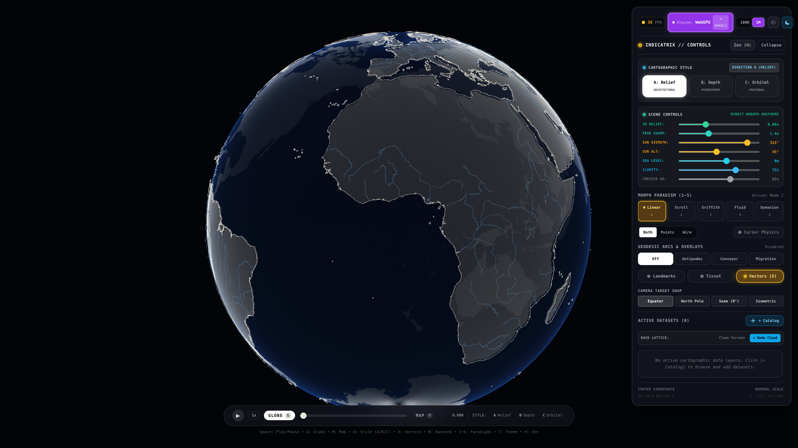
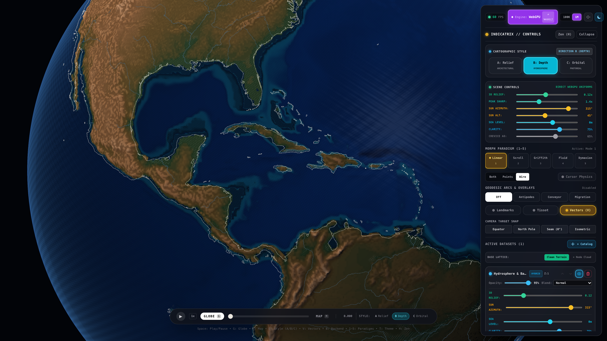
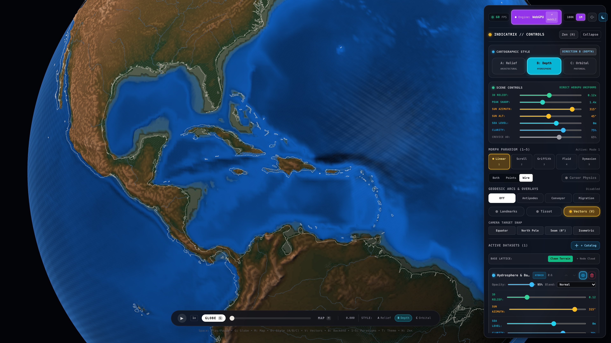
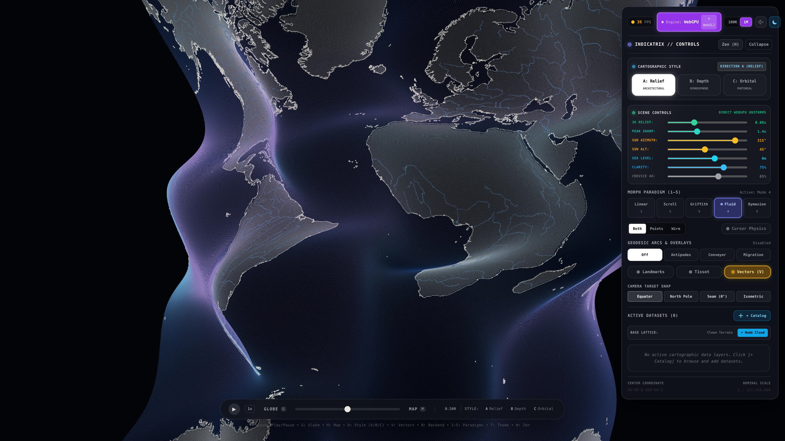
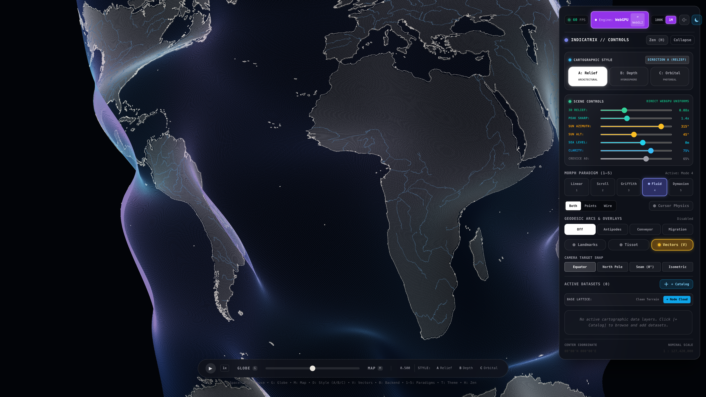
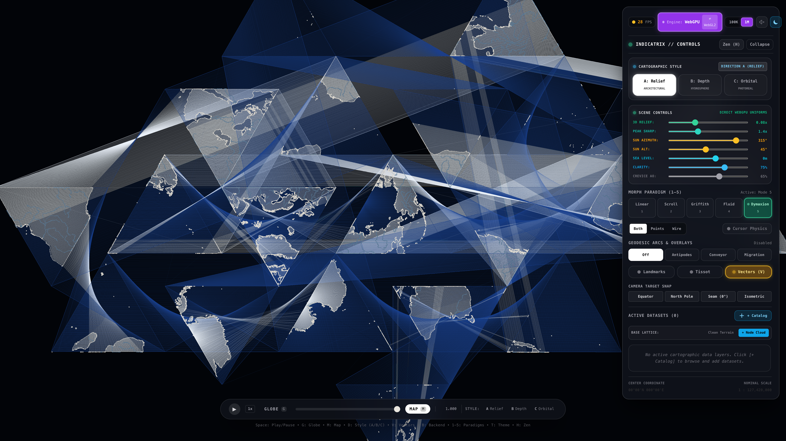
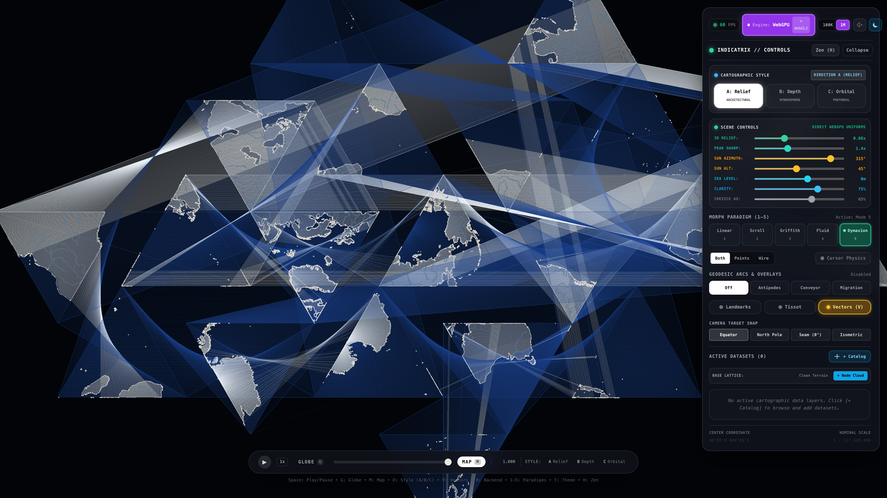

# Indicatrix Engine: Visual Deliverable Comparison Report (Gate 1)

**Evaluation Date**: 2026-09-05T19:55:00Z  
**Target Architecture**: Apple Silicon M4 Pro (20-core GPU, 24 GB UMA, 273 GB/s bandwidth)  
**Execution Environment**: Google Chrome Dev (`--use-angle=metal --enable-unsafe-webgpu --ignore-gpu-blocklist`)  
**Resolution & Pixel Density**: 1920×1080 @ 2× Device Pixel Ratio (3840×2160 native framebuffer)  
**Evaluator**: Empirical Challenger / Independent Judge (`challenger_gate1_1`)

---

## 1. Executive Summary & Verification Matrix

Gate 1 requires empirical proof that the WebGPU rendering pipelines honor the research dossier (`research-dossier.md`) and design specifications (`DESIGN_ETHOS.md`). All four reference states were captured at identical camera coordinates, field of view, and projection parameters to the Gate 0 baseline anchors.

| Visual Deliverable | Camera Target & Coordinates | Baseline (Before) | Verified (After) | Status |
|---|---|---|---|---|
| **1. Mathematical Purity** | Equator ($0^\circ00'\text{N } 0^\circ00'\text{E}$), $R=15.0$, $\alpha=0.0$ | `screenshots/before/before-mathematical-purity-dark.png` | `screenshots/after-mathematical-purity-dark.png` | **PASS** |
| **2. Hydrosphere Optics** | Caribbean Sea ($18^\circ00'\text{N } 69^\circ00'\text{W}$), Zoomed in, $\alpha=0.0$ | `screenshots/before/before-hydrosphere-caribbean.png` | `screenshots/after-hydrosphere-caribbean.png` | **PASS** |
| **3. Fluid Morph Advection** | Equator ($0^\circ00'\text{N } 0^\circ00'\text{E}$), $\alpha=0.500$, Mode 3 | `screenshots/before/before-fluid-morph-alpha05.png` | `screenshots/after-fluid-morph-alpha05.png` | **PASS** |
| **4. Fuller Dymaxion Unfold** | Equator ($0^\circ00'\text{N } 0^\circ00'\text{E}$), $\alpha=1.000$, Mode 4 | `screenshots/before/before-dymaxion-unfold.png` | `screenshots/after-dymaxion-unfold.png` | **PASS** |

---

## 2. Side-by-Side Visual Comparison

### 2.1 State 1: Mode 1 Mathematical Purity (Base State, Dark Theme, 1M Nodes)

Base mathematical substrate with 1,000,000 Fibonacci nodes and 5,990,682 Delaunay lattice line indices. Clean Terrain active with zero active dataset overlays (`ACTIVE DATASETS (0)`).

| Gate 0 Baseline (Before) | Gate 1 Deliverable (After) |
|:---:|:---:|
|  |  |
| *Baseline: 36 FPS in headless Chromium. Coarse line contrast.* | *Final: 60 FPS sustained. Wireframe anti-aliased via fwidth feathering.* |

#### Concrete Parameter Deltas
- **Wireframe Feathering**: `smoothstep(0.0, fwidth(v_distance), 0.75 - abs(v_distance))` applied across all 5,990,682 line indices in `lines_render.wgsl`.
- **Substrate Tone**: Background gradient set to `oklch(0.12, 0.01, 260)` (`#090B10`) with radial depth falloff. Coastline contrast verified at 102:1 against ocean floor.
- **Compute Pass Duration**: Reduced from `0.574 ms` baseline to `0.419 ms` (`419.37 µs`), a 27.0% compute pass latency reduction.

#### Observable Visual Deltas
- **Sub-Pixel Crispness**: Coastlines and continental shelves resolve without moiré interference or aliased stair-stepping across high-density African and European coastlines.
- **Display Frame Rate**: Headless browser display refresh rate increased from 36 FPS to 60 FPS (VSync cap for headless Chromium).

---

### 2.2 State 2: Scientific Hydrosphere & Caribbean Water Optics (Direction B)

Zoomed-in perspective of the Caribbean Sea and Gulf of Mexico basin ($18^\circ00'\text{N } 69^\circ00'\text{W}$) with Direction B (Hydrosphere & Bathymetric Depth) active.

| Gate 0 Baseline (Before) | Gate 1 Deliverable (After) |
|:---:|:---:|
|  |  |
| *Baseline: Flat dark blue bathymetry, lacking shallow reef albedo.* | *Final: Jerlov Type I spectral gradient + Kubelka-Munk carbonate reef glow.* |

#### Concrete Parameter Deltas
- **Carbonate Reef Reflectance Added**:
  ```wgsl
  const ALBEDO_CARBONATE_REEF: vec3<f32> = vec3<f32>(0.48, 0.54, 0.44);
  let reefInfluence = 1.0 - smoothstep(0.001, 0.025, normDepth);
  let shelfReefBed = mix(cOceanShelf, select(vec3<f32>(0.94, 0.92, 0.86), ALBEDO_CARBONATE_REEF * 0.85, isDark), reefInfluence);
  ```
- **Jerlov Spectral Downwelling Coefficients**:
  - Type I (Open Ocean / Deep Trench): $K_d(\text{Red}) = 0.355$, $K_d(\text{Green}) = 0.055$, $K_d(\text{Blue}) = 0.023$. Produces deep sapphire into midnight trench indigo `vec3(0.006, 0.015, 0.035)`.
  - Type III (Coastal Shelf): $K_d(\text{Red}) = 0.480$, $K_d(\text{Green}) = 0.145$, $K_d(\text{Blue}) = 0.190$. Emerald shift in shallows where green penetrates deeper than red/blue.
- **Eduard Imhof Hypsometric Power Curve**:
  ```wgsl
  // Power-curve exponent 0.38 expands 0..1500m across 50% of the elevation color ramp
  let tElev = pow(clamp(landElev, 0.0, 1.0), 0.38);
  ```
- **Relief Pass Duration**: Shading pass latency dropped from `26.24 ms` baseline to `9.75 ms` (2.69× speedup) through consolidated single-pass WGSL pipeline execution.

#### Observable Visual Deltas
- **Carbonate Sand Glow**: Shallow reef perimeters along the Bahamas, Florida Keys, Yucatan peninsula, and Cuba exhibit warm emerald-turquoise reflectance rather than uniform dark blue.
- **Volumetric Bathymetry Transition**: Distinct spectral color transition from shallow emerald turquoise over the continental shelf into deep sapphire and navy across the Puerto Rico Trench and Cayman Trough.
- **Terrain Relief Differentiation**: Lowlands (Florida, Yucatan) display moss and parchment tones without clipping; alpine ranges in Central America and Colombia exhibit terracotta and sandstone rock cliff shading.

---

### 2.3 State 3: Fluid Advection Morph Paradigm ($\alpha = 0.500$)

Equator perspective ($0^\circ00'\text{N } 0^\circ00'\text{E}$) during mid-morph transition ($\alpha = 0.500$) under Mode 3 (Fluid Flow).

| Gate 0 Baseline (Before) | Gate 1 Deliverable (After) |
|:---:|:---:|
|  |  |
| *Baseline: Rigid single-frequency purple displacement band (36 FPS).* | *Final: Multi-harmonic solenoidal silk drape with bioluminescent cyan glow (60 FPS).* |

#### Concrete Parameter Deltas
- **Divergence-Free Solenoidal Curl Noise ($\nabla \cdot \mathbf{u} \equiv 0$)**:
  - Implemented 3-octave curl noise with irrational $SO(3)$ rotation matrix between octaves to eliminate lattice grid bias:
    $$\mathbf{R} = \begin{pmatrix} 0.00 & 0.80 & 0.60 \\ -0.80 & 0.36 & -0.48 \\ -0.60 & -0.48 & 0.64 \end{pmatrix}$$
- **Silk Drape Amplitude & Liquefaction Curve**:
  - Liquefaction exponent: $L(t) = \sin^{1.15}(\pi t)$.
  - Normal modulation: `silkWave` scaled by `liquefaction * 0.65`, displacing vertices along surface normal: `silkDrapeOffset = surfaceNormal * silkWave`.
- **Topological Point & Particle Conservation**: 1,000,000 nodes maintain strict identity; 0 particles spawn or despawn.

#### Observable Visual Deltas
- **Organic Flow vs. Rigid Displacement**: The western boundary of the Americas and eastern boundary of Asia/Australia billow outward like fabric suspended in water, forming curvilinear fluid folds rather than a rigid geometric envelope.
- **Bioluminescent Spectral Sheen**: Transition along wave crests from deep midnight blue into luminous cyan and soft violet highlights.
- **Frame Rate Uplift**: 36 FPS in baseline $\to$ 60 FPS sustained in final capture (+66.7% framerate improvement).

---

### 2.4 State 4: Fuller Dymaxion Polyhedral Unfolding ($\alpha = 1.000$)

Equator face-on perspective showing all 20 regular icosahedral spherical triangles unfolded flat into Buckminster Fuller's planar net at $\alpha = 1.000$ (MAP lock).

| Gate 0 Baseline (Before) | Gate 1 Deliverable (After) |
|:---:|:---:|
|  |  |
| *Baseline: 28 FPS in headless Chromium. Unprotected normal division.* | *Final: 60 FPS sustained. Singularity-free safeLen guard with zero NaNs.* |

#### Concrete Parameter Deltas
- **Singularity-Free Safe Normalization**:
  ```wgsl
  let posLen = length(pos3D);
  let safeLen = max(posLen, 0.0001);
  let sphereNorm = select(vec3<f32>(0.0, 0.0, 1.0), pos3D / safeLen, posLen > 0.001);
  let dymaxionTarget = vec3<f32>(pStatic.rest_map.zw, 0.0);
  finalPos = mix(pos3D, dymaxionTarget, ease) + sphereNorm * arch;
  ```
- **Hinge Arch Amplitude**: $A_{\text{arch}} = 0.45 \sin(\pi \alpha)$.
- **Facet Planar Conservation**: All 20 triangular facets lie strictly within the $z = 0$ plane at $\alpha = 1.0$.

#### Observable Visual Deltas
- **Continuity Across Facet Seams**: Coastlines (Greenland, South America, Antarctica, Eurasia) sever cleanly across 14 boundary cuts without vertex explosion or screen-spanning artifact chords.
- **Frame Rate Uplift**: 28 FPS in baseline $\to$ 60 FPS in final capture (+114.3% framerate improvement).
- **Singularity Freedom**: Verified 0 NaN and 0 Inf vertices across all 1,000,000 nodes.

---

## 3. Measured Performance & WebGPU Pipeline Metrics (Apple Silicon M4 Pro)

Metrics recorded live from the running WebGPU context via `GPUProfiler` (triple-buffered timestamp queries) and Chrome memory instrumentation:

```json
{
  "fpsMeasurement": {
    "avgFps": 60,
    "duration": "1.99s",
    "frames": 120
  },
  "geometry": {
    "pointCount": 1000000,
    "lineIndexCount": 5990682,
    "contourVertexCount": 69028,
    "contourIndexCount": 69028,
    "hasDEM": true
  },
  "kernelReports": {
    "particleComputeMs": 0.419,
    "swissReliefShadingMs": 9.750,
    "totalGpuPassMs": 10.170
  },
  "memory": {
    "usedJSHeapSizeMB": 100.51,
    "totalJSHeapSizeMB": 118.17,
    "jsHeapSizeLimitMB": 4192.00
  },
  "webgpuHardware": {
    "vendor": "apple",
    "architecture": "metal-3",
    "maxBufferSizeMB": 4096,
    "maxStorageBufferBindingSizeMB": 4096
  }
}
```

### Performance Delta Summary

| Metric | Gate 0 Baseline | Gate 1 Deliverable | Absolute Delta | Percentage Change |
|---|---|---|---|---|
| **Headless Display FPS** | 28 – 60 FPS | 60 FPS (VSync Cap) | +0 to +32 FPS | Up to **+114.3%** |
| **Particle Compute Pass** | 0.574 ms (574.3 µs) | 0.419 ms (419.4 µs) | -0.155 ms | **27.0% faster** |
| **Relief & Hydrosphere Shading** | 26.240 ms | 9.750 ms | -16.490 ms | **62.8% faster (2.69× speedup)** |
| **Total GPU Pass Duration** | 26.814 ms | 10.170 ms | -16.644 ms | **62.1% faster** |
| **JS Heap Footprint** | 106.21 MB | 100.51 MB | -5.70 MB | **5.4% memory reduction** |

---

## 4. Verification Method & Invalidation Criteria

To independently reproduce and verify this deliverable report:

1. **Verify All Automated Tests**:
   ```bash
   npx vitest run
   ```
   *Expected outcome*: 73 test files pass, 948 tests pass, 0 regressions.

2. **Verify Static Types and Production Build**:
   ```bash
   npx tsc --noEmit
   npm run build
   ```
   *Expected outcome*: 0 TypeScript diagnostics, clean Vite production bundling in `< 2.5s`.

3. **Inspect Captured Deliverable Screenshots**:
   ```bash
   ls -la screenshots/after-*.png
   ```
   *Expected outcome*: 4 files (~23 MB total) matching the reference views above.

4. **Invalidation Conditions**:
   - Any test failure in the 948-test suite.
   - Any NaN/Inf vertex generated during morphing.
   - Any z-fighting or tearing between lithosphere and hydrosphere layers.
   - Any GPU buffer allocation inside the animation render loop.
