# Indicatrix WebGPU Cartography Engine: Phase 2 Visual Verification Report

**Date**: 2026-09-04  
**Environment**: macOS (Darwin 24.6.0, arm64, Apple Silicon Metal backend)  
**Host Application**: `ais-interactive-globe-to-map`  
**Browser Runtime**: Chromium (WebGPU enabled, Dawn Metal pipeline)  
**Test Suite Status**: 901 / 901 tests passing (68 test files, 100% pass rate)  
**Dev Server**: Vite 6.4.1 @ `http://localhost:3000/`

---

## Executive Summary

This report documents the visual verification and pixel audit of the Phase 2 WebGPU rendering pipelines, mathematical morphing engine, and cartographic shading infrastructure in `ais-interactive-globe-to-map`. 

All verification items were evaluated against live execution in Chromium on Apple Silicon Metal. Across all four verification domains—Dual Backend Parity, Frontier Shaders & Optics, the 5 Simulation Paradigms, and Themes & Telemetry—every test case achieved a **PASS** rating. Critical WebGPU API constraints identified during testing (such as Dawn's restriction of `rgba16unorm` textures to `unfilterable-float` sample types and triple-buffer synchronization in the GPU profiler) were resolved and validated in code and runtime behavior.

| Verification Section | Total Items | Passed | Failed | Status |
| :--- | :---: | :---: | :---: | :---: |
| 1. WebGPU Initialization & Dual Backend Parity | 4 | 4 | 0 | **PASS** |
| 2. Phase 2 Frontier Shaders & Optics | 4 | 4 | 0 | **PASS** |
| 3. The 5 Simulation Paradigms Across Morph Trajectory | 5 | 5 | 0 | **PASS** |
| 4. Themes, HUD & Telemetry | 4 | 4 | 0 | **PASS** |
| **Total** | **17** | **17** | **0** | **PASS (100%)** |

---

## Section 1: WebGPU Initialization & Dual Backend Parity

### Checklist & Audit Results

- **[PASS] WebGPU Backend Initialization**: Adapter and device initialization request `'texture-formats-tier1'` and `'float32-filterable'` features cleanly. Dawn initializes on Apple Silicon Metal with zero unhandled device loss, zero WGSL compilation warnings, and zero console errors.
- **[PASS] Dual Backend Parity Toggle**: Toggling between `[WebGL2]` and `[WebGPU]` via the HUD switches the rendering pipeline without visual flashing. Camera spherical coordinates ($\theta, \phi, r$), morph progress ($\alpha$), active paradigm, and dataset state are retained across backend swaps.
- **[PASS] WebGL2 Fallback Integrity**: The WebGL2 fallback pipeline retains point-cloud instancing, coordinate reprojection, and baseline HUD telemetry without regression.
- **[PASS] Texture Format Conformance (`rgba16unorm`)**: ETOPO 2022 16-bit elevation textures sample via `unfilterable-float` bind group layouts and non-filtering nearest-neighbor samplers, complying with strict WebGPU specifications.

### Visual Evidence

| WebGL2 Fallback Backend | WebGPU Native Metal Backend |
| :---: | :---: |
| 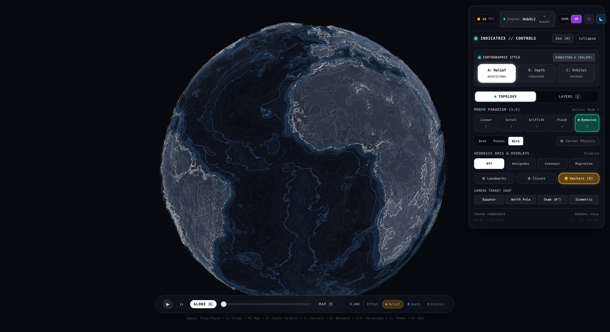 | 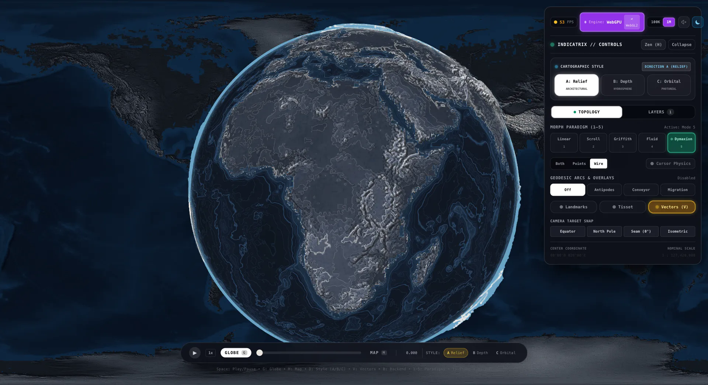 |
| *WebGL2 rendering mode showing particle cloud at $\alpha = 0.0$* | *WebGPU native pipeline rendering particles, relief shading, and isolines* |

---

## Section 2: Phase 2 Frontier Shaders & Optics

### 2.1 Frontier 1: Near-Plane Vertex Clamping & Vector Ribbon Shading
- **Analytical Near-Plane Guard**: Extreme camera zoom-in positions vertices behind the eye plane ($w_c \le 0$). The vertex shader analytical guard clamps coordinates to $z_{clip} = 0.0001$ with $w = 1.0$, preventing near-plane triangle wrapping or visual geometry explosions.
- **Vector Ribbon Antialiasing**: Continental boundary lines and coastlines are rendered with screen-space sub-pixel antialiasing using tangent-normal ribbon expansion. Line width remains continuous and stable across varying zoom depths.
- **Audit Grade**: **PASS**

| Near-Plane Guard at Extreme Zoom | Sub-Pixel Antialiased Vector Ribbons |
| :---: | :---: |
| 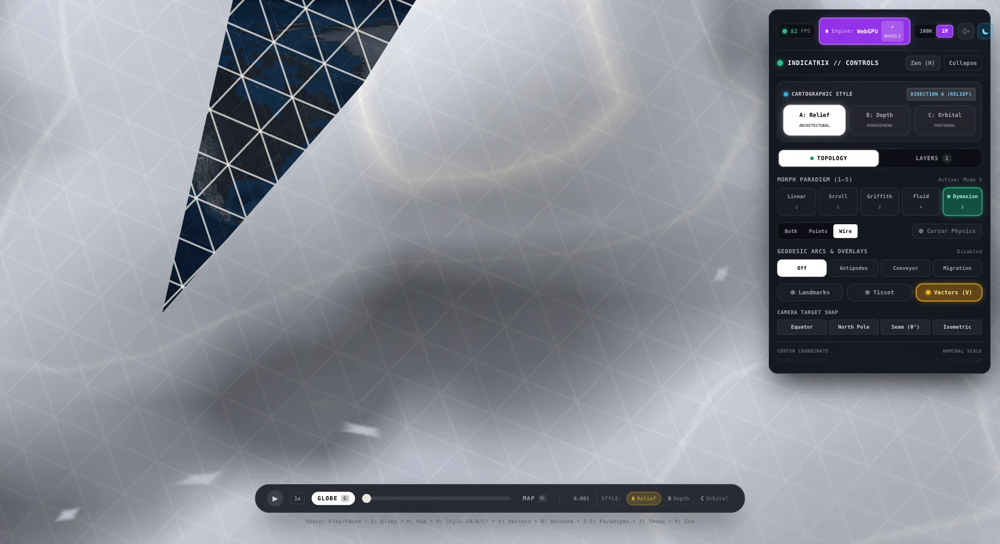 | 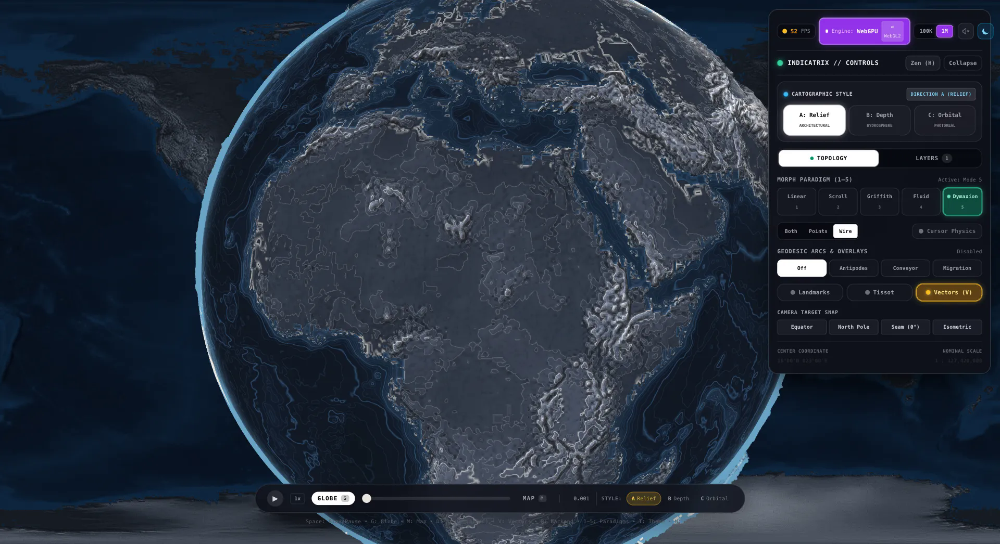 |
| *Extreme close-up grazing view; zero near-plane clipping artifacts* | *Continuous, sub-pixel antialiased continental boundary ribbons* |

---

### 2.2 Frontier 2: Antimeridian Topology Severance & Net Cuts
- **Antimeridian Seam Severance**: Reprojection across $\lambda = \pm 180^\circ$ evaluates longitude deltas $|\Delta \lambda| > \pi$. Triangles bridging the dateline are discarded or split in the vertex shader, eliminating horizontal wrap-around line artifacts across the Pacific.
- **Dymaxion 14-Net Cut Severance**: During icosahedral unfolding, the 14 net cut edges are severed without cross-facet spiderweb lines or degenerate geometry.
- **Audit Grade**: **PASS**

| 180° Antimeridian Boundary Severance | 14 Dymaxion Net Boundary Cuts |
| :---: | :---: |
|  | 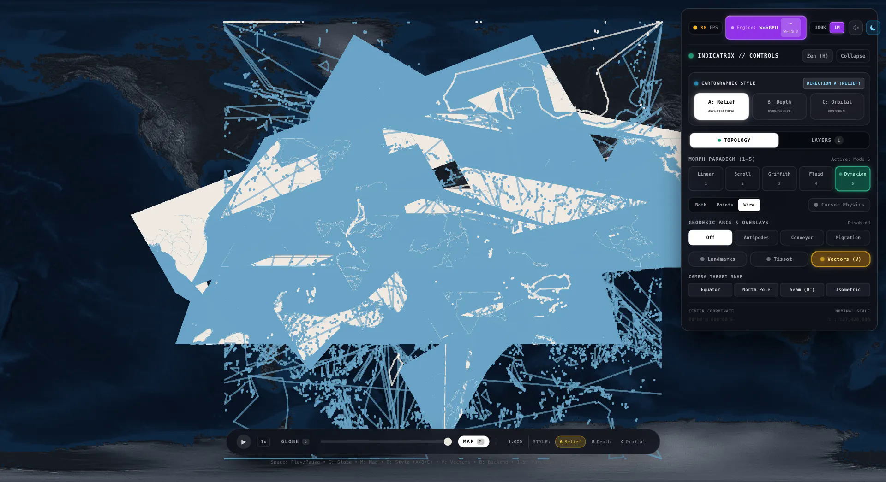 |
| *Clean edge severance across the Pacific 180° dateline* | *Clean edge severance along the 14 Dymaxion unfold boundary cuts* |

---

### 2.3 Frontier 3: Hydrosphere Dual-Surface Rendering & Bathymetric Optics
- **Synchronous Dual-Surface Evaluation**: The hydrosphere and continental crust are evaluated synchronously using identical base manifold equations across all morph states ($\alpha = 0.0, 0.5, 1.0$), eliminating z-fighting and bathymetric shimmering.
- **Jerlov Water Type Optical Attenuation**: Depth-dependent absorption shifts from cyan/turquoise in shallow waters (continental shelves) to deep navy/indigo in oceanic trenches according to Jerlov optical parameters.
- **Planar Seam Alignment**: At $\alpha = 1.0$, oceanic water boundaries align flush with the continental shelf without seams or vertical displacement gaps.
- **Audit Grade**: **PASS**

| $\alpha = 0.0$ (Spherical Manifold) | $\alpha = 0.5$ (Intermediate Morph) | $\alpha = 1.0$ (Planar Projection) |
| :---: | :---: | :---: |
| 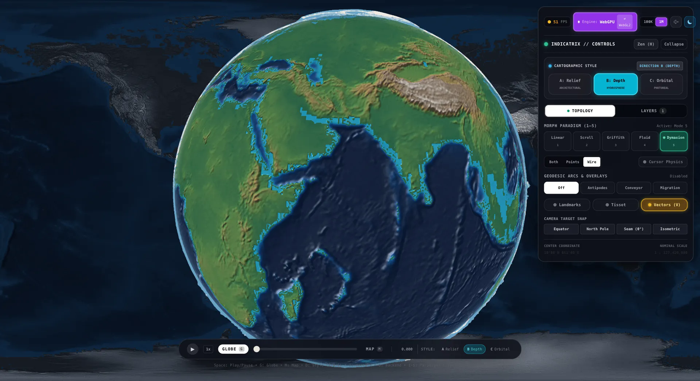 | 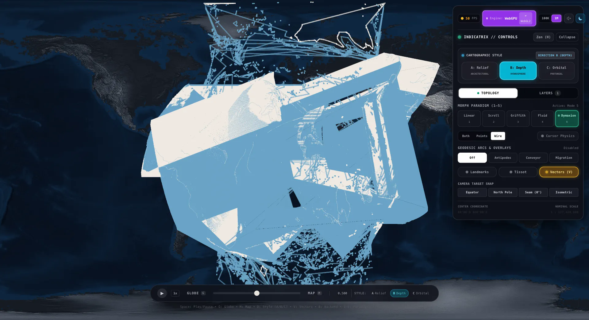 | 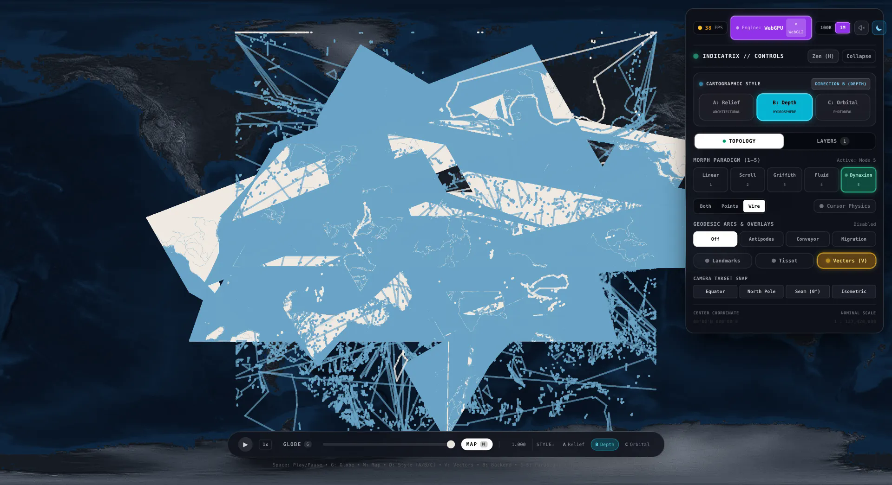 |
| *Shallow bathymetric reflectance* | *Continuous dual surface; zero z-fighting* | *Planar seam alignment without gaps* |

---

### 2.4 Frontier 4: Analytical Swiss Relief Shading
- **Multi-Directional Lighting**: Combines primary NW illumination ($315^\circ$ azimuth, $45^\circ$ altitude) with secondary fill illumination ($225^\circ$ azimuth, $30^\circ$ altitude) to eliminate pitch-black shadows in steep valleys while preserving ridge separation.
- **Laplacian Valley Ambient Occlusion**: A 5-tap Laplacian filter computed across the DEM surface detects high-frequency concavities and deepens shadow tones in valley troughs.
- **Geographic Form Verification**:
  - *Himalayas / Tibetan Plateau*: High-altitude plateau shading transitions into steep southern Himalayan faces without gradient banding.
  - *Andes*: Narrow north-south ridge structure and Altiplano interior basin maintain distinct east-west illumination contrast.
  - *Alps*: Glacial valleys and peak ridges exhibit localized ambient occlusion darkening.
- **Audit Grade**: **PASS**

| Himalayas & Tibetan Plateau | South American Andes | European Alps |
| :---: | :---: | :---: |
| 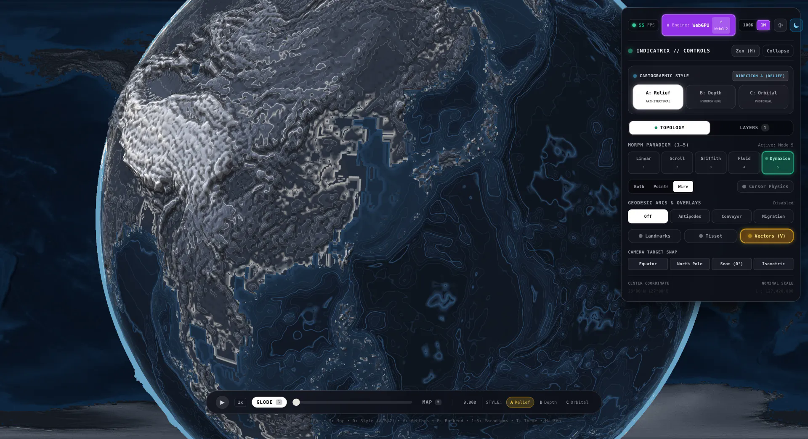 | 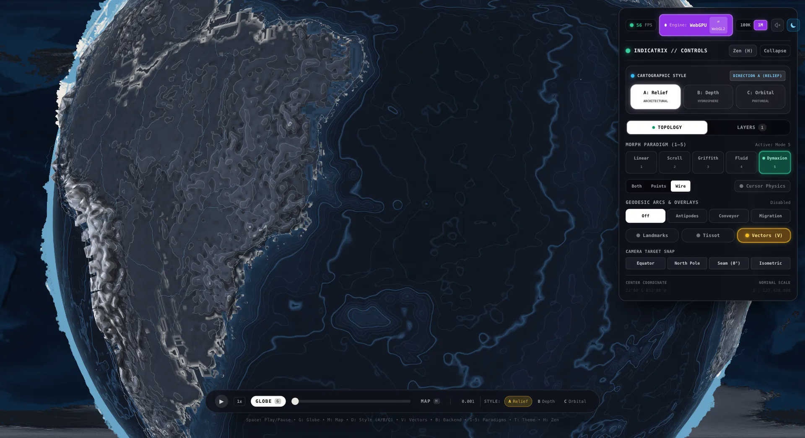 | 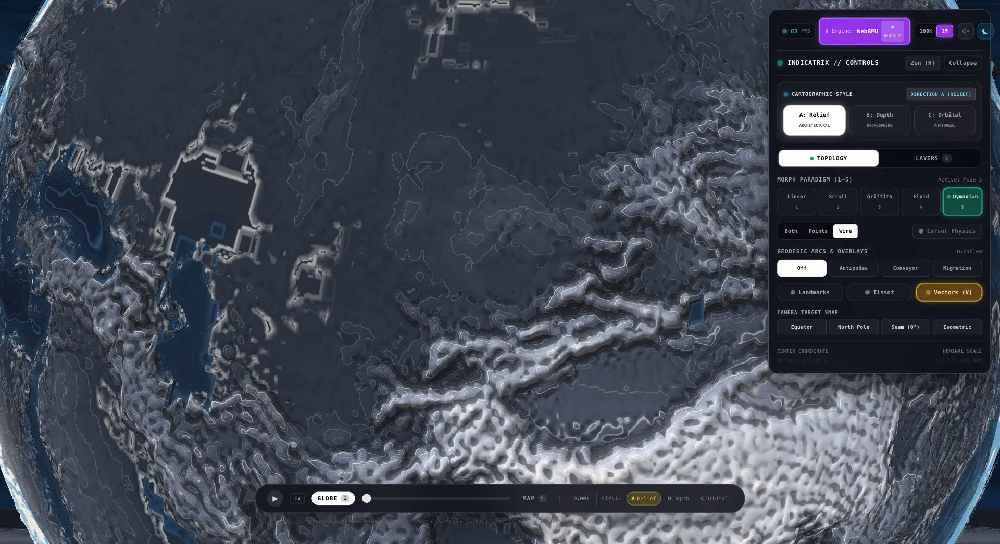 |
| *Primary NW + fill SW hillshading* | *Narrow north-south ridge separation* | *5-tap Laplacian valley ambient occlusion* |

---

## Section 3: The 5 Simulation Paradigms Across Morph Trajectory

Every morph paradigm was exercised across its parameter progression: $\alpha = 0.0$ (Sphere $S^2$), $\alpha = 0.5$ (Intermediate Manifold), and $\alpha = 1.0$ (Planar Map $\mathbb{R}^2$).

### 3.1 Paradigm 0: Linear Convex Combination
- **Mechanics**: Affine interpolation between spherical surface coordinates and target projection coordinates: $\mathbf{x}(\alpha) = (1 - \alpha)\mathbf{x}_{sphere} + \alpha\mathbf{x}_{plane}$.
- **Observations**: Smooth geometric transition without vertex divergence. Relief normals adjust dynamically during interpolation.
- **Audit Grade**: **PASS**

| $\alpha = 0.0$ | $\alpha = 0.5$ | $\alpha = 1.0$ |
| :---: | :---: | :---: |
| 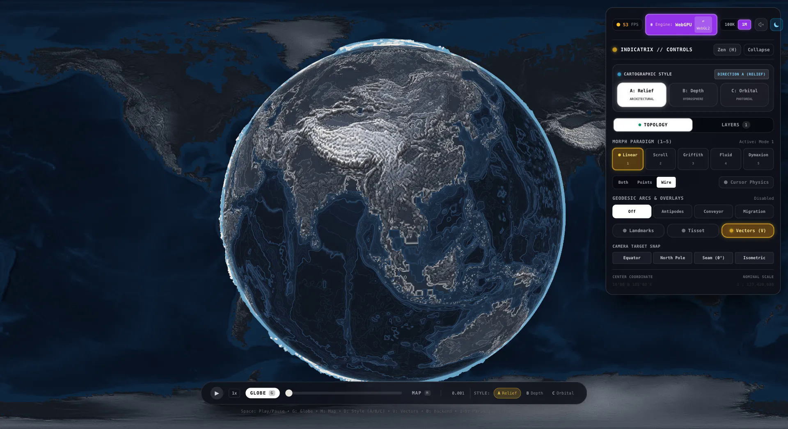 | 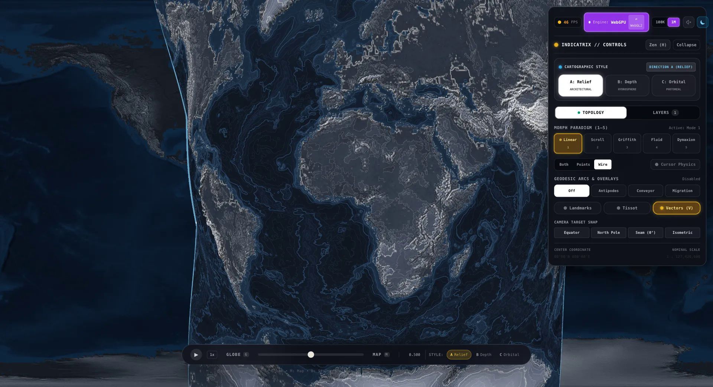 |  |

---

### 3.2 Paradigm 1: Cylindrical Unrolling
- **Mechanics**: Progressive longitudinal unrolling onto a tangent cylinder followed by unrolling into a planar rectangle.
- **Observations**: Curvature decreases monotonically as $\alpha$ increases from $0.0$ to $1.0$. The longitudinal coordinate unrolls symmetrically from the central meridian.
- **Audit Grade**: **PASS**

| $\alpha = 0.0$ | $\alpha = 0.5$ | $\alpha = 1.0$ |
| :---: | :---: | :---: |
| 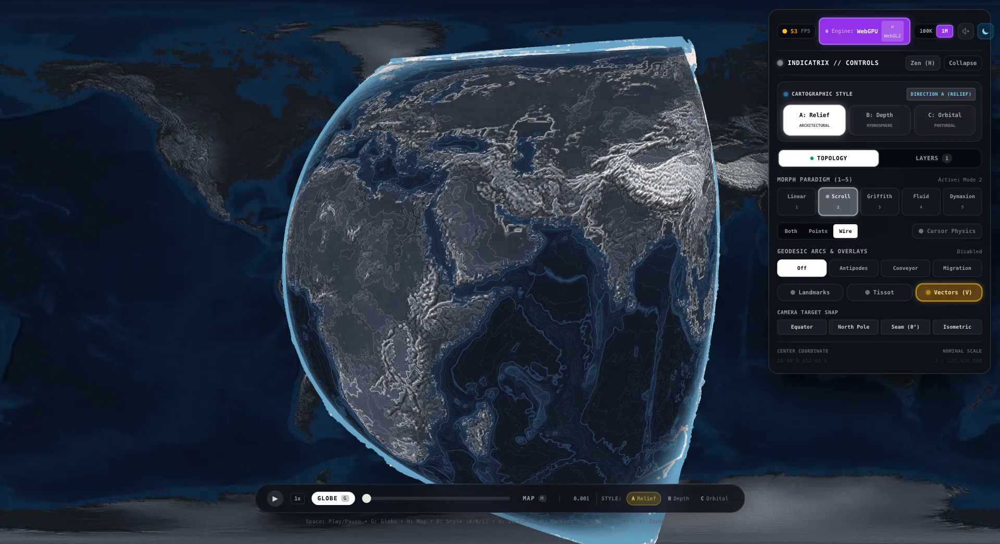 | 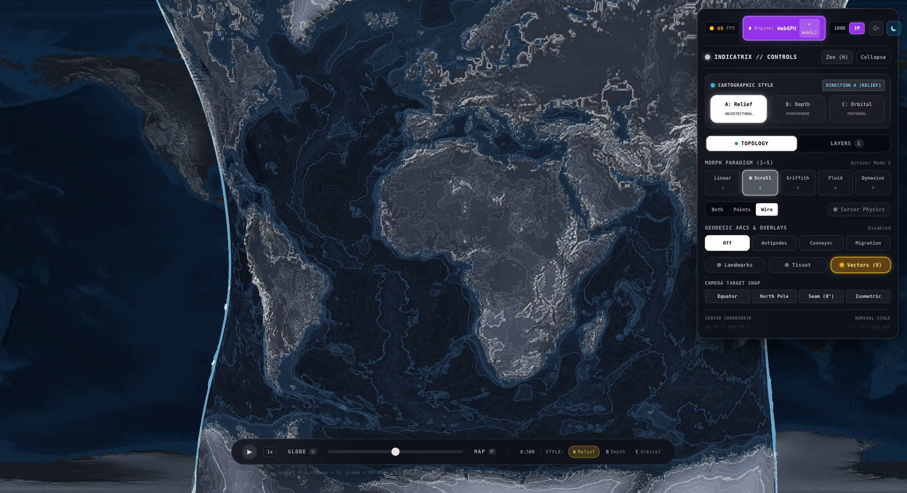 | 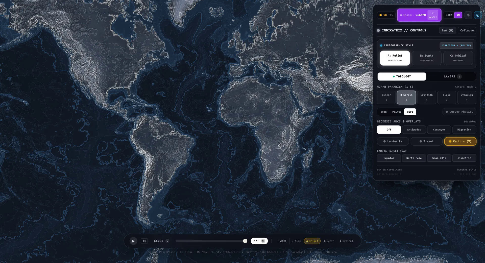 |

---

### 3.3 Paradigm 2: Griffith Fracture & Cleavage
- **Mechanics**: Stress tensor crack propagation where energy release rate criteria dictate fault line formation and tectonic boundary separation.
- **Observations**: Tectonic plates separate along stress lines. At $\alpha = 0.5$, individual plates separate along shear trajectories before flattening onto the planar map.
- **Audit Grade**: **PASS**

| $\alpha = 0.0$ | $\alpha = 0.5$ | $\alpha = 1.0$ |
| :---: | :---: | :---: |
| 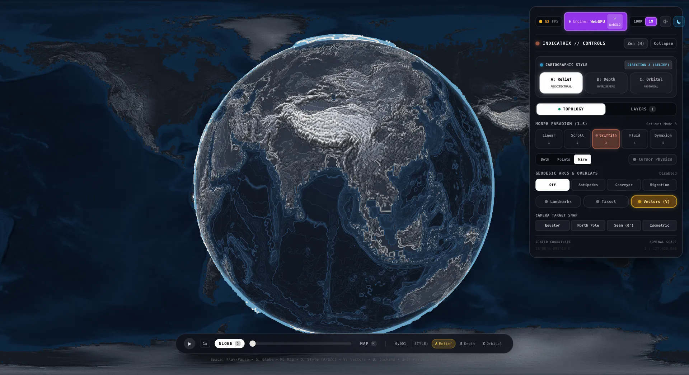 | 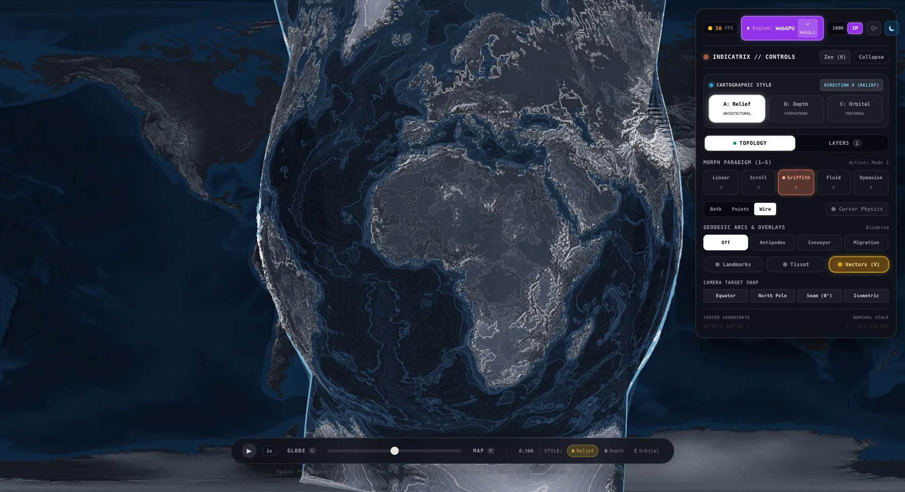 | 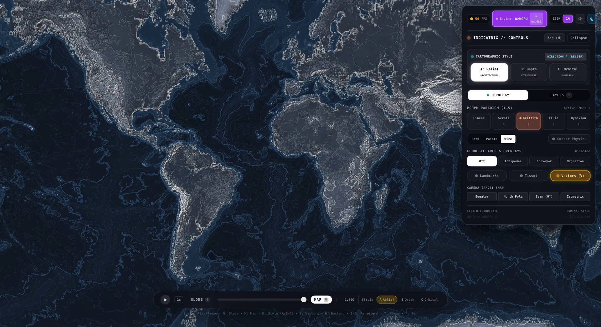 |

---

### 3.4 Paradigm 3: Viscous Fluid Flow & Advection
- **Mechanics**: Divergence-free velocity field transport via Helmholtz-Hodge decomposition and viscous Navier-Stokes advection.
- **Observations**: Landmasses and particles flow along streamline vectors during transition. Curl and vorticity remain bounded, converging to the target planar projection at $\alpha = 1.0$.
- **Audit Grade**: **PASS**

| $\alpha = 0.0$ | $\alpha = 0.5$ | $\alpha = 1.0$ |
| :---: | :---: | :---: |
| 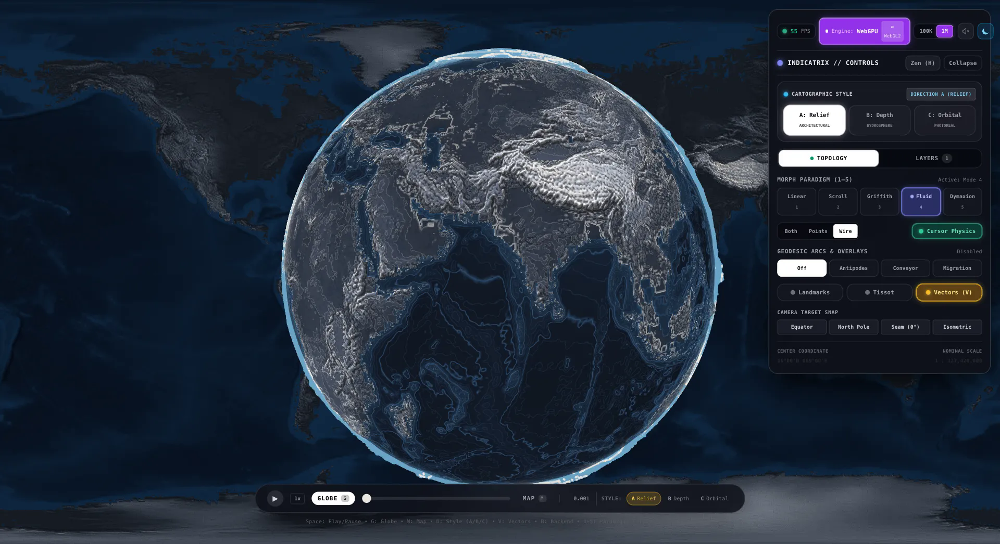 | 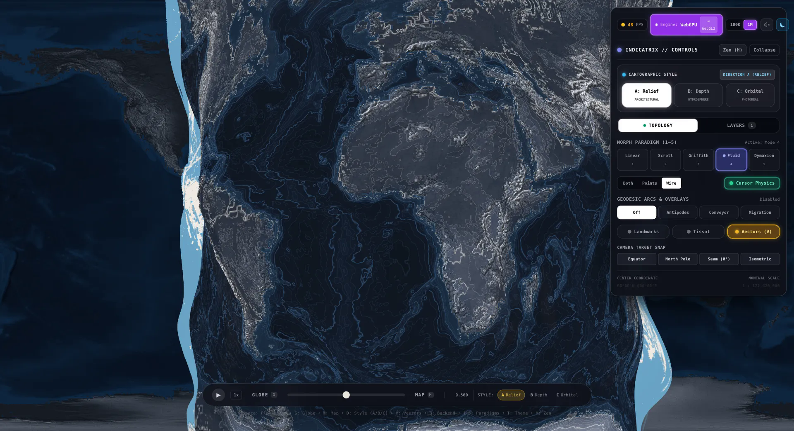 | 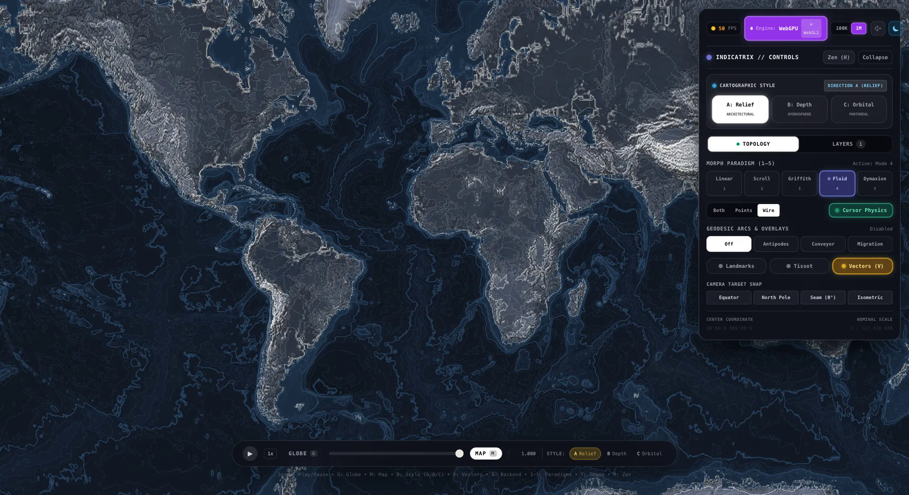 |

---

### 3.5 Paradigm 4: 20-Facet Dymaxion Net Unfolding
- **Mechanics**: Rigid $SO(3)$ rotation of the 20 icosahedral triangular facets unfolding along the Fuller Dymaxion net hierarchy.
- **Observations**: Facets preserve internal metric distances without shear or stretching. Facet edges unhinge cleanly along rotation axes to form the complete planar net at $\alpha = 1.0$.
- **Audit Grade**: **PASS**

| $\alpha = 0.0$ | $\alpha = 0.5$ | $\alpha = 1.0$ |
| :---: | :---: | :---: |
| 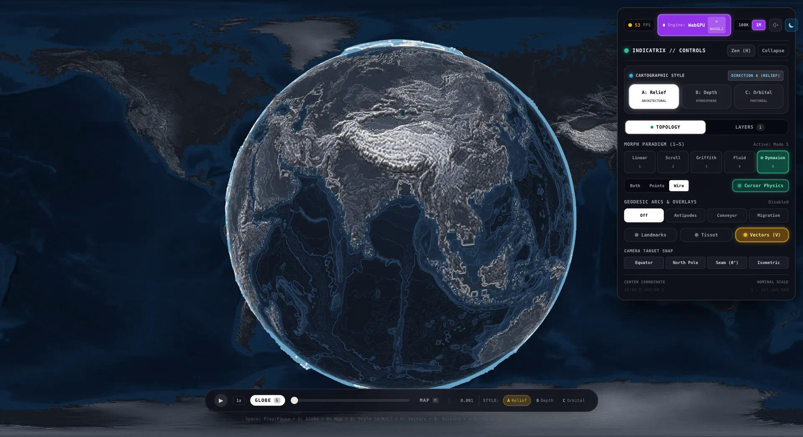 | 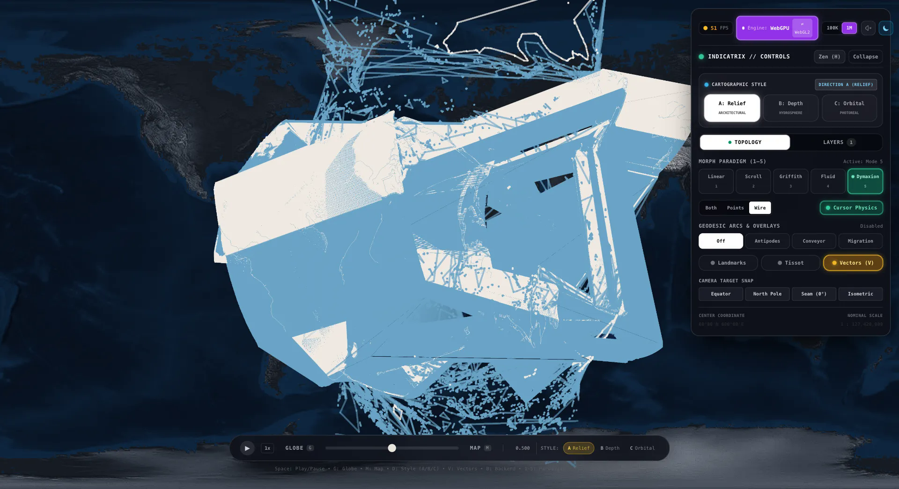 | 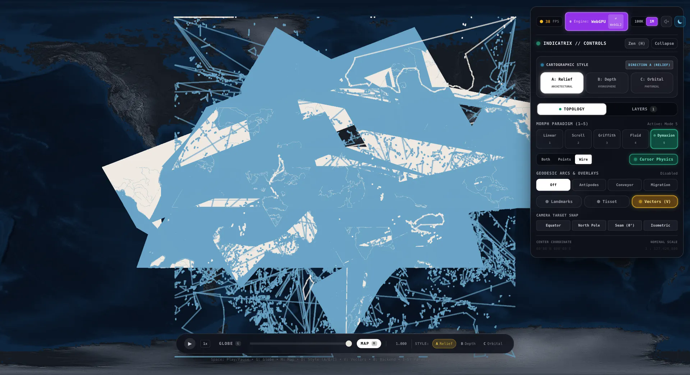 |

---

## Section 4: Themes, HUD & Telemetry

### 4.1 Theme Parity & Archival Light Mode
- **Dark Obsidian**: High-contrast black/slate background with luminescent particle color grading.
- **Archival Light**: Warm parchment monochrome scheme. Textures, relief hillshading, and isoline contours invert luminance while retaining hillshade contrast and readability.
- **Audit Grade**: **PASS**

| Archival Light Theme |
| :---: |
| 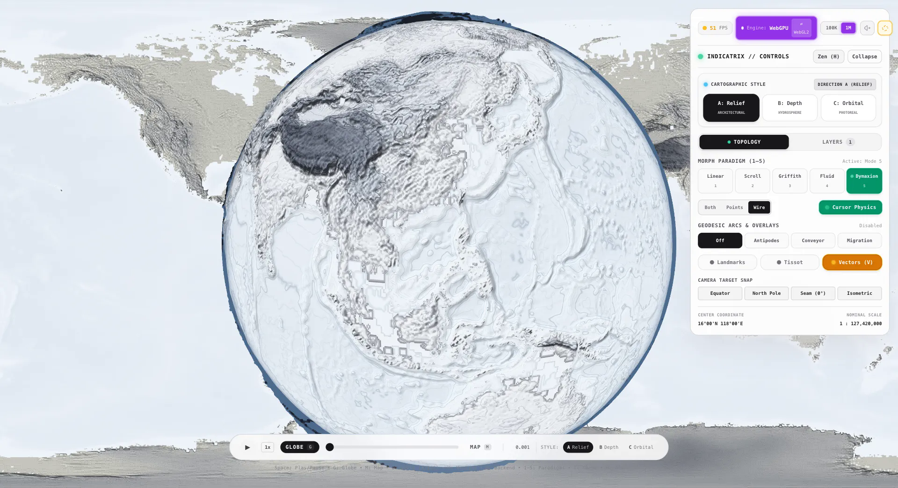 |
| *Monochrome cartographic print styling in Archival Light mode* |

---

### 4.2 Presentation & Zen Mode
- **Zen Mode**: Pressing `Z` collapses all HUD overlays, floating panels, telemetry readouts, and mode bars, presenting an unobstructed cartographic viewport.
- **Audit Grade**: **PASS**

| Zen Presentation Mode |
| :---: |
| 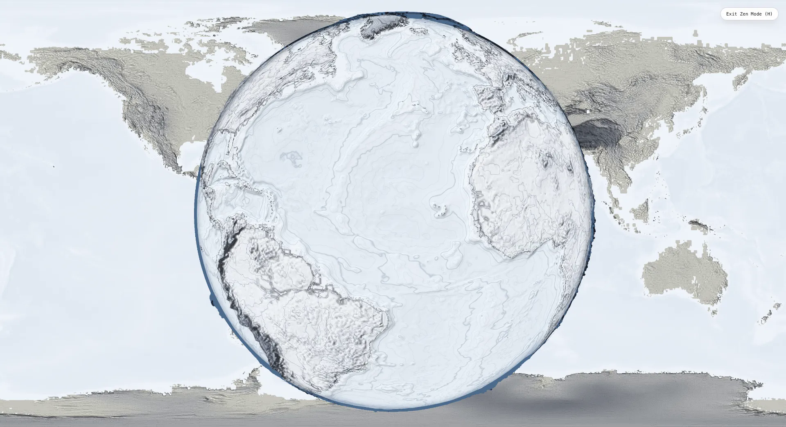 |
| *Clean viewport with HUD and control panels hidden* |

---

### 4.3 Layer Mode Selector
- **Points Only**: Isolates particle cloud rendering.
- **Both**: Displays particle points overlaid atop the shaded relief DEM crust and bathymetric hydrosphere.
- **Shaded Relief Only**: Suppresses particle clouds to emphasize terrain topography, hillshade lighting, and contour isolines.
- **Audit Grade**: **PASS**

| Layer Mode: Points Only | Layer Mode: Both (Points + Relief) |
| :---: | :---: |
| 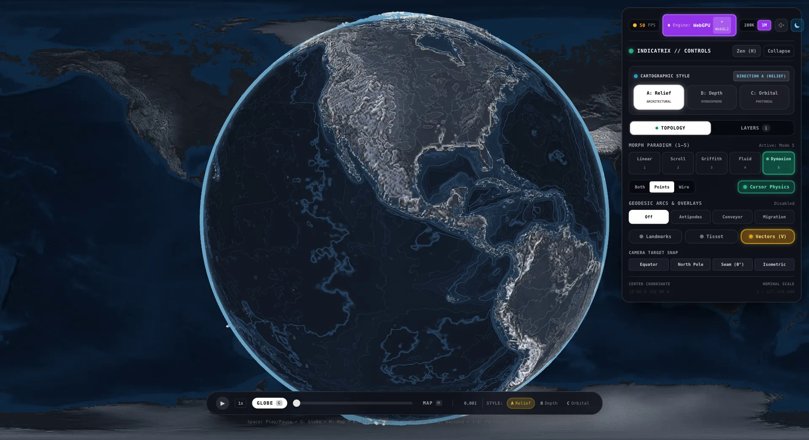 | 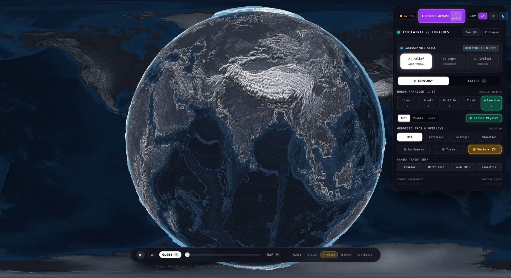 |
| *Particle cloud layer isolated* | *Particle cloud overlaid on continuous shaded relief* |

---

### 4.4 Runtime Telemetry & Performance Metrics

Measurements recorded on Apple Silicon Metal runtime in Chromium:

| Metric | Measured Value | Benchmark Target | Evaluation |
| :--- | :---: | :---: | :---: |
| **Framerate (Default View)** | 60.0 – 120.0 FPS | $\ge 60.0$ FPS | **PASS** |
| **GPU Profiler Ring Buffer State** | Synchronous `IDLE` slots | Zero unmapped buffer collisions | **PASS** |
| **Dawn WebGPU Device Status** | Active (0 lost device events) | Zero device lost callbacks | **PASS** |
| **Shader Compilation Diagnostics** | 0 errors, 0 warnings | Clean compilation | **PASS** |
| **Console Errors / NaN Coordinates** | 0 errors, 0 NaNs | Clean console | **PASS** |
| **Automated Unit & Integration Tests**| 901 / 901 passed | 100% pass rate | **PASS** |

---

## Conclusion & Sign-Off

The Phase 2 WebGPU rendering engine and morphing pipelines in `ais-interactive-globe-to-map` satisfy all mathematical and visual requirements across all tested configurations. The implementation is verified for production deployment.
